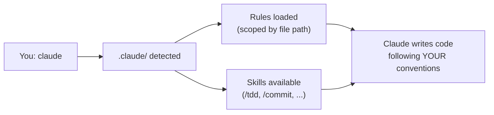
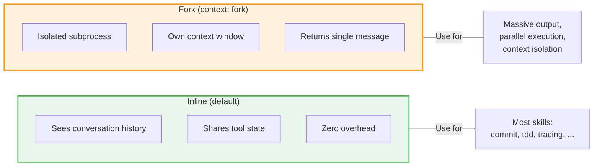
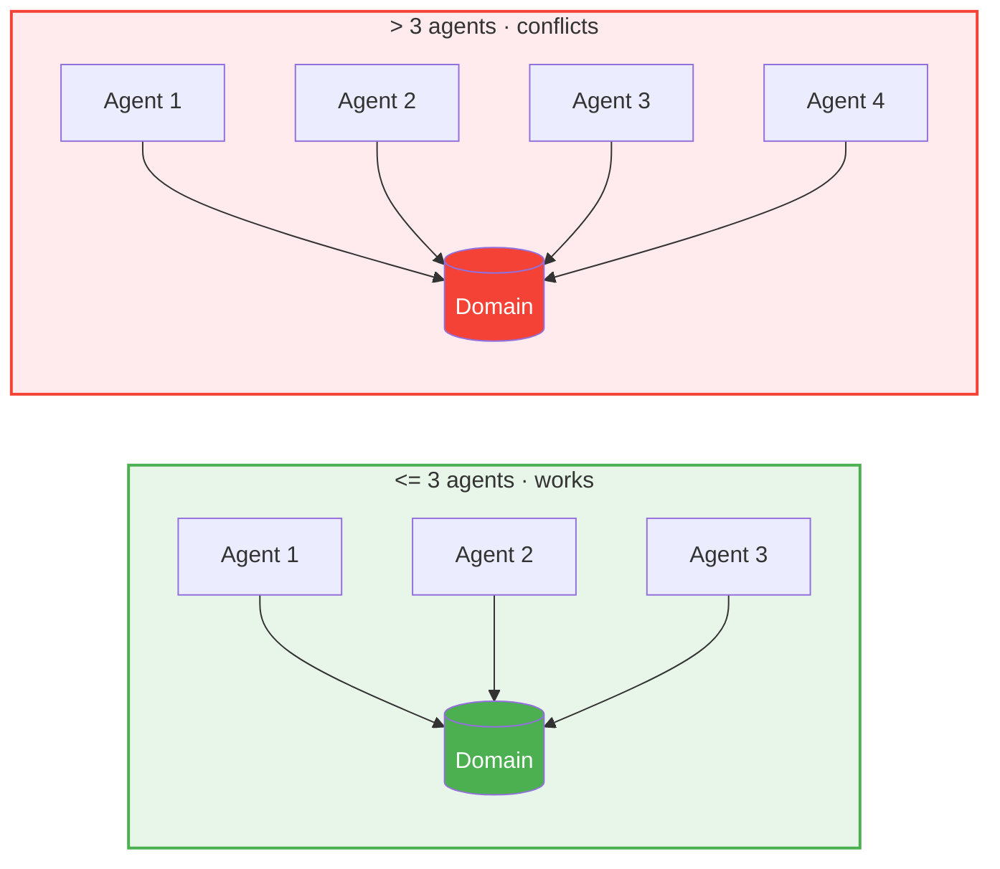
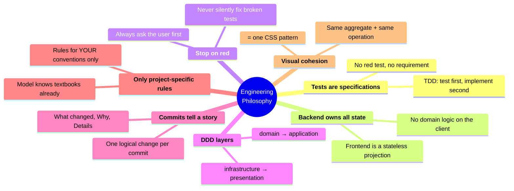

<div align="center">

# awesome-claude

**Not a list of links. A working `.claude/` directory you drop into any project.**

Battle-tested rules, skills, and agents that turn Claude Code into a senior engineer on your team.

[](LICENSE)
[](https://claude.ai/code)
[](#-quick-start)
[](#-rules)
[](#-skills)
[](CONTRIBUTING.md)

<br>

```bash
curl -fsSL https://raw.githubusercontent.com/Hedgehogues/awesome-claude/release-0.6.0/scripts/install.sh | bash
```

Run. Start Claude Code. Everything loads automatically.

</div>

---

## Why?

Out of the box, Claude Code is powerful but generic. It doesn't know your architecture, commit style, testing philosophy, or how your team works.

**You end up repeating the same instructions every session:**

> "Write tests first, then implementation"
> "Use DDD layers: domain -> application -> infrastructure -> presentation"
> "Stop and ask me if tests break -- don't try to fix them yourself"
> "Commit messages must have What/Why/Details sections"

**awesome-claude** solves this. Clone once -- Claude remembers forever.

---

## What's Inside

```
.claude/
├── rules/                   project-specific conventions
│   ├── arch/                DDD contracts, tests, security, state ownership
│   ├── break-stop.md        hard stop when tests break
│   ├── git.md               structured commit messages
│   ├── frontend-*.md        UI design, testing, components
│   └── meta-rules.md        how to write rules
├── skills/                  skill implementations (loaded on demand)
│   ├── dev/                 /dev:tdd, /dev:commit, /dev:tracing, ...
│   ├── report/              /report:describe, /report:session-report
│   ├── research/            /research:triz
│   └── sdd/                 /sdd:propose, /sdd:apply, /sdd:archive, ...
├── commands/                slash command entry points
│   ├── dev/
│   ├── report/
│   ├── research/
│   └── sdd/
├── scripts/
│   ├── install.sh           install or update awesome-claude
│   └── bump-namespace.sh    update a single namespace to latest
└── docs/
    ├── SKILL_DESIGN.md      how to write skills: inline vs fork, model selection
    ├── RULES_GUIDE.md       how to write rules that don't waste tokens
    ├── REPO_ORGANIZATION.md monorepo structure, DDD anatomy, 3-agent rule
    └── STRANGLER_PATTERN.md reorganize bounded contexts without breaking
```

---

## How It Works



**Rules** use YAML frontmatter to scope when they activate. Claude only sees what's relevant:

```yaml
---
paths:
  - "src/domain/**"        # only loads when editing domain files
  - "src/application/**"
---
```

**Skills** are slash commands you invoke directly. Type `/tdd` and watch the full red-green-refactor cycle.

---

## Quick Start

```bash
# 1. Install into your project root
curl -fsSL https://raw.githubusercontent.com/Hedgehogues/awesome-claude/release-0.6.0/scripts/install.sh | bash

# 2. Exclude from your project's git
echo ".claude/" >> .gitignore

# 3. Start Claude Code -- everything loads automatically
claude
```

**Updating a namespace:**

```bash
# Update only what you need
bash .claude/scripts/bump-namespace.sh dev
bash .claude/scripts/bump-namespace.sh sdd
```

Each namespace is versioned independently. Dependencies are resolved automatically.

---

## Skills

Type a slash command in Claude Code to activate a skill. Each skill runs a full workflow -- not just a prompt, but a multi-step process with verification.

> **Writing your own?** See [Skill Design Principles](docs/SKILL_DESIGN.md) -- inline vs fork execution, model selection, prompt compression, `!`command`` precomputation, hooks, and a checklist for shipping.

Skills run in two modes. **Inline** (default) injects the prompt into the current conversation -- the skill sees your full history and shares tool state. **Fork** (`context: fork`) runs in an isolated subprocess -- useful when a skill produces massive output or needs a clean context. All 16 skills in this repo are inline.



#### `dev:` — Engineering & Development

| Command | What It Does | Model |
|---------|-------------|-------|
| **`/dev:tdd`** | Full TDD cycle: test plan, red tests, green implementation, refactor. Covers unit/state/security/integration/e2e. | Opus |
| **`/dev:tracing`** | Traces bugs across all layers (frontend → API → backend → DB). Generates sequence + C4 diagrams showing the failure path. | Opus |
| **`/dev:fix-bug`** | Combines `/dev:tracing` (root cause) + `/dev:tdd` (test-first fix). Two-phase bug repair. | Opus |
| **`/dev:fix-tests`** | Fixes failing tests by modifying **logic, not tests**. Tests are the spec. | Sonnet |
| **`/dev:dead-features`** | Finds implemented but unreachable functionality. Checks connectivity across layers. | Sonnet |
| **`/dev:init-repo`** | Scaffolds a full DDD monorepo: FastAPI + React 19 + architecture tests. `make check` passes out of the box. | Sonnet |
| **`/dev:commit`** | Analyzes all changes, drafts structured commit (What/Why/Details), waits for approval. Never auto-pushes. | Haiku |
| **`/dev:deploy`** | Docker rebuild + container restart + Alembic migrations. | Haiku |
| **`/dev:test-all`** | Runs every test suite across all packages (unit, integration, e2e). Reports delta vs previous run. | Haiku |

#### `report:` — Summaries & Descriptions

| Command | What It Does | Model |
|---------|-------------|-------|
| **`/report:describe`** | One-paragraph product description of what was done. Stakeholder-friendly, no tech details. | Haiku |
| **`/report:session-report`** | Product-focused summary from current conversation context. Pure introspection. | Haiku |

#### `research:` — Analysis & Problem Solving

| Command | What It Does | Model |
|---------|-------------|-------|
| **`/research:triz`** | TRIZ problem-solving: ARIZ-85V algorithm — contradiction analysis, IFR, 40 inventive principles, vepole analysis. | Opus |

#### `sdd:` — Spec-Driven Development (OpenSpec)

Requires [OpenSpec CLI](https://openspec.dev): `npm install -g @fission-ai/openspec@latest && openspec init`

| Command | What It Does |
|---------|-------------|
| **`/sdd:propose`** | Propose a new change: generate proposal, design, specs, tasks in one step |
| **`/sdd:apply`** | Implement tasks from tasks.md |
| **`/sdd:archive`** | Archive completed change, sync delta specs to `openspec/specs/` |
| **`/sdd:explore`** | Enter exploration mode — non-linear, applicable at any phase |
| **`/sdd:help`** | Show repo state and full workflow pipeline |
| **`/sdd:contradiction`** | Check change artifacts for contradictions and broken references |
| **`/sdd:change-verify`** | Verify implementation against tasks.md |
| **`/sdd:spec-verify`** | Verify implementation against live spec in `openspec/specs/` |
| **`/sdd:audit`** | Audit manifest consistency (structural + semantic) |
| **`/sdd:repo`** | Add / update branch / remove submodule via guided flow |
| **`/sdd:sync`** | Initialize and synchronize submodules |

---

## Rules

Rules load automatically based on file path matching. When you edit `src/domain/user.py`, Claude sees DDD rules. When you edit `tests/`, it sees testing conventions. No manual selection needed.

> We deliberately keep rules lean: **15 files, ~60K chars**. Generic knowledge (DDD textbooks, 12-factor, Fowler refactoring catalog) was removed -- the model already knows it. Only project-specific conventions remain. See [Rules Guide](docs/RULES_GUIDE.md) for the rationale.

<details>
<summary><strong>Architecture & DDD Contracts (7 rules)</strong></summary>

| Rule | What It Enforces |
|------|-----------------|
| `ARCH_TESTS.md` | Automated DDD contract validation (R1--R5) with auto-discovery via `src/domain/*/entity.py` |
| `UNIT_TESTS.md` | Test conventions UT1--UT13: docstrings, structure, no shared mutable state |
| `LLM_SECURITY.md` | LLM output as untrusted input, prompt injection prevention |
| `STATE_OWNERSHIP.md` | Backend is the single source of truth for all mutable state |
| `VISUAL_COHESION.md` | Same aggregate + same operation = one CSS pattern |
| `SERVICES.md` | Handlers call services, not use cases directly (R7 test) |
| `VIEWS.md` | Presentation layer: pure functions, per-aggregate separation (R6 test) |

</details>

<details>
<summary><strong>Workflow & Conventions (8 rules)</strong></summary>

| Rule | What It Enforces |
|------|-----------------|
| `break-stop.md` | **Hard stop** when tests break -- ask before fixing |
| `git.md` | Commit messages with What / Why / Details sections |
| `meta-rules.md` | How to write and maintain rules themselves |
| `frontend-testing.md` | Vitest + Testing Library + Playwright patterns |
| `frontend-design.md` | Icons-first UI, accessibility, component patterns |
| `makefile.md` | Makefile hierarchy and delegation |
| `monorepo-structure.md` | Monorepo layout conventions |
| `ui-library.md` | 4-layer component architecture (tokens -> primitives -> shared -> domain) |

</details>

---

## Customization

| What | Where | Tracked By |
|------|-------|-----------|
| Universal rules, skills, agents | `.claude/` | awesome-claude repo |
| Your project-specific instructions | `CLAUDE.md` in your project root | your project's repo |
| Project-specific skills (deploy, test-all) | edit in `.claude/skills/` after cloning | awesome-claude (local) |
| Personal preferences | `~/.claude/CLAUDE.md` | not tracked |

### Adding Your Own Rules

> **Before writing rules, read the [Rules Guide](docs/RULES_GUIDE.md)** — how to avoid paying tokens for textbook knowledge the model already has.

Create a markdown file in `.claude/rules/` with path scoping:

```markdown
<!-- .claude/rules/my-convention.md -->
---
paths:
  - "src/**/*.py"
---

# My Convention

All services must log entry and exit with structlog.
```

Claude will only see this rule when editing Python files under `src/`.

### Adapting Skills to Your Stack

Skills like `/deploy` and `/test-all` contain project-specific commands. After cloning, edit them to match your stack:

```bash
# Edit deploy skill for your infrastructure
vim .claude/skills/deploy/SKILL.md

# Edit test runner for your test setup
vim .claude/skills/test-all/SKILL.md
```

---

## Repo Organization

> **Full guide with diagrams: [docs/REPO_ORGANIZATION.md](docs/REPO_ORGANIZATION.md)**

The number of product features maps directly to the number of bounded contexts in the backend. Each feature is a vertical slice through all DDD layers — not files scattered across shared directories.

**The 3-Agent Rule:** From our experience, no more than 3 concurrent AI agent groups can work on the same domain without conflicts. The bottleneck is shared wiring files (`models.py`, `dependencies.py`, `router.py`, `conftest.py`) — with 4+ agents, merge conflicts outnumber productive changes.

**When boundaries shift**, use the [Strangler Pattern](docs/STRANGLER_PATTERN.md) to reorganize BCs: move domain first (aggregate + repo + exceptions), then follow with application and infrastructure layers, verifying with `make check` between each phase.



---

## Philosophy

This collection is opinionated. It encodes a specific engineering philosophy:



If this matches how you work -- clone and go. If not -- fork and make it yours.

---

## FAQ

<details>
<summary><strong>Does this work with any project or only Python/React?</strong></summary>

The architecture rules (DDD contracts, state ownership, test conventions) are **language-agnostic**. The frontend rules target React + TypeScript + Vite, but principles transfer. Skills like `/deploy` and `/test-all` are project-specific by design -- edit them for your stack.

</details>

<details>
<summary><strong>Won't all rules load at once and slow Claude down?</strong></summary>

No. Rules use YAML `paths:` frontmatter to scope activation -- Claude only loads rules relevant to the files being edited. We also keep the total footprint lean (~60K chars) by excluding textbook knowledge the model already has. See [Rules Guide](docs/RULES_GUIDE.md) for our approach.

</details>

<details>
<summary><strong>Can I use just the skills without the rules?</strong></summary>

Yes. Delete the `rules/` directory. Skills and agents work independently.

</details>

<details>
<summary><strong>How do I update?</strong></summary>

Update a specific namespace to the latest version:

```bash
bash .claude/scripts/bump-namespace.sh dev
bash .claude/scripts/bump-namespace.sh sdd
```

Or use the slash command from Claude Code:

```
/dev:bump-version
/sdd:bump-version
```

Each namespace is versioned independently. If a namespace has dependencies on others, they are updated automatically.

</details>

<details>
<summary><strong>What if a rule conflicts with my project conventions?</strong></summary>

Three options:
1. **Override in `CLAUDE.md`** -- project-specific instructions in your root `CLAUDE.md` take precedence
2. **Edit the rule** -- modify it locally in `.claude/rules/`
3. **Delete the rule** -- remove files you don't need

</details>

<details>
<summary><strong>Do skills work with Claude Sonnet or only Opus?</strong></summary>

Skills specify their model in YAML frontmatter. Complex skills (TDD, TRIZ, tracing) use Opus. Analytical skills (dead-features, fix-tests) use Sonnet. Mechanical skills (commit, deploy, describe, test-all) use Haiku for speed and cost efficiency. You can change the `model:` field in any skill's frontmatter.

</details>

---

## License

[MIT](LICENSE) -- use it, fork it, share it.
