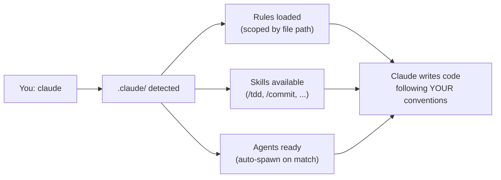
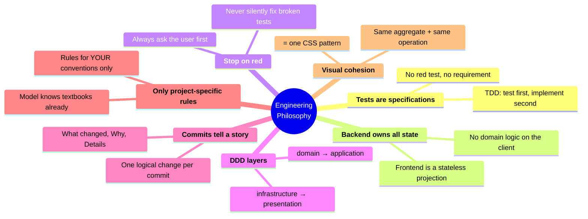

<div align="center">

# awesome-claude

**Not a list of links. A working `.claude/` directory you drop into any project.**

Battle-tested rules, skills, and agents that turn Claude Code into a senior engineer on your team.

[](LICENSE)
[](https://claude.ai/code)
[](#-quick-start)
[](#-rules)
[](#-skills)
[](#-agents)
[](CONTRIBUTING.md)

<br>

```
git clone git@github.com:Hedgehogues/awesome-claude.git .claude
```

Clone. Start Claude Code. Everything loads automatically.

</div>

---

## Why?

Out of the box, Claude Code is powerful but generic. It doesn't know your architecture, commit style, testing philosophy, or how your team works.

**You end up repeating the same instructions every session:**

> "Write tests first, then implementation"
> "Use DDD layers: domain -> application -> infrastructure -> presentation"
> "Stop and ask me if tests break -- don't try to fix them yourself"
> "Commit messages must have What/Why/Details sections"

**awesome-claude** solves this. Clone once -- Claude remembers forever.

---

## What's Inside

```
.claude/
├── rules/           15 project-specific conventions (~60K chars)
│   ├── arch/        DDD contracts, tests, security, state ownership
│   ├── break-stop.md     hard stop when tests break
│   ├── git.md            structured commit messages
│   ├── frontend-*.md     UI design, testing, components
│   └── meta-rules.md     how to write rules (see also docs/RULES_GUIDE.md)
├── skills/          slash commands (/tdd, /commit, /tracing, ...)
├── agents/          specialized sub-agents (planner, code-review, ui-ux)
└── docs/
    └── RULES_GUIDE.md    how to write rules that don't waste tokens
```

---

## How It Works



**Rules** use YAML frontmatter to scope when they activate. Claude only sees what's relevant:

```yaml
---
paths:
  - "src/domain/**"        # only loads when editing domain files
  - "src/application/**"
---
```

**Skills** are slash commands you invoke directly. Type `/tdd` and watch the full red-green-refactor cycle.

**Agents** are specialized sub-processes that Claude spawns automatically when the task matches their expertise.

---

## Quick Start

```bash
# 1. Clone into your project root
git clone git@github.com:Hedgehogues/awesome-claude.git .claude

# 2. Exclude from your project's git (it has its own repo)
echo ".claude/" >> .gitignore

# 3. Start Claude Code -- everything loads automatically
claude
```

**Updating:**

```bash
cd .claude && git pull
```

That's it. No config files. No setup scripts. No dependencies.

---

## Skills

Type a slash command in Claude Code to activate a skill. Each skill runs a full workflow -- not just a prompt, but a multi-step process with verification.

> **Writing your own?** See [Skill Design Principles](skills/SKILL_DESIGN.md) -- model selection, prompt compression, `!`command`` precomputation, hooks, and a checklist for shipping.

| Command | What It Does | Model |
|---------|-------------|-------|
| **`/tdd`** | Full TDD cycle: PlantUML diagrams, test plan, red tests, green implementation, refactor. Covers unit/state/security/integration/e2e. | Opus |
| **`/commit`** | Analyzes all changes, drafts structured commit (What/Why/Details), shows plan, waits for your approval. Never auto-pushes. | default |
| **`/triz`** | TRIZ problem-solving: ARIZ-85V algorithm -- contradiction analysis, IFR, 40 inventive principles, vepole analysis, structured resolution. | Opus |
| **`/tracing`** | Traces bugs across all layers (frontend -> API -> backend -> DB). Generates PlantUML sequence + C4 component diagrams showing the failure path. | Opus |
| **`/ui`** | Senior UI/UX engineer: TDD-first React components with accessibility, responsive design, visual cohesion. | Opus |
| **`/pipe`** | Meta-orchestrator: chains skills sequentially (`/pipe triz,tdd Fix the button`). Each phase runs in a dedicated Agent. | Opus |
| **`/test-all`** | Runs every test suite across all packages (unit, integration, e2e). Reports statistics with delta vs previous run. | Opus |
| **`/session-report`** | Generates product-focused summary of uncommitted changes, grouped by user-facing features. | default |
| **`/init-repo`** | Scaffolds a full DDD monorepo: FastAPI backend (entity, repo, use case, routes) + React 19 frontend + architecture tests. `make check` passes out of the box. [Design doc](skills/init-repo/DESIGN.md). | Sonnet |
| **`/deploy`** | Docker rebuild + container restart + Alembic migrations. Adapt to your stack. | default |
| **`/describe`** | Quick project overview without running any commands. Pure text output. | default |

### How `/pipe` Works

Chain any skills into a sequential pipeline. Output of each phase feeds into the next:

```
/pipe triz,ui     "Sidebar is cramped on mobile"
       │    │
       │    └── Phase 2: UI engineer implements the TRIZ solution
       └─────── Phase 1: TRIZ analyzes the contradiction
```

```
/pipe tracing,tdd "Delete button doesn't work after deploy"
       │       │
       │       └── Phase 2: TDD writes tests + fix for the root cause
       └──────── Phase 1: Tracing finds where the request breaks
```

### Bootstrapping a Project

```bash
/init-repo acme-crm leads
```

Generates a ready-to-run monorepo with backend (FastAPI DDD with `leads` bounded context), frontend (React 19 + Vite), root orchestration (Makefile, docker-compose), and tests that pass immediately. See the [architecture diagrams](skills/init-repo/DESIGN.md).

---

## Agents

Agents are specialized sub-processes that Claude Code spawns automatically when a task matches their expertise. You don't invoke them -- Claude does.

### Planner

**Activates on:** new features, complex tasks, multi-file changes

Analyzes requirements completeness (goal, acceptance criteria, edge cases, dependencies), maps affected files across DDD layers, assesses risks (architecture, DB, testing, performance, security), and produces a step-by-step implementation plan with verification steps and commit breakdown.

### Code Review Sentinel

**Activates on:** after writing or modifying code

Reviews against project rules with special focus on **test quality**. Flags trivial tests (mock assertions, vacuous truths, decorator testing), checks DDD layer violations, SOLID principles, security vulnerabilities. Renders verdict: APPROVE / REQUEST CHANGES / BLOCK.

### UI/UX Engineer

**Activates on:** frontend components, page redesigns, UX fixes

20+ years of design-to-code experience. Works test-first: writes Vitest + Testing Library tests before implementation. Builds modern 2020s interfaces with accessibility (ARIA, keyboard navigation), micro-interactions, responsive design, and CSS Modules. Enforces visual cohesion rule.

---

## Rules

Rules load automatically based on file path matching. When you edit `src/domain/user.py`, Claude sees DDD rules. When you edit `tests/`, it sees testing conventions. No manual selection needed.

> We deliberately keep rules lean: **15 files, ~60K chars**. Generic knowledge (DDD textbooks, 12-factor, Fowler refactoring catalog) was removed -- the model already knows it. Only project-specific conventions remain. See [Rules Guide](docs/RULES_GUIDE.md) for the rationale.

<details>
<summary><strong>Architecture & DDD Contracts (7 rules)</strong></summary>

| Rule | What It Enforces |
|------|-----------------|
| `ARCH_TESTS.md` | Automated DDD contract validation (R1--R5) with auto-discovery via `src/domain/*/entity.py` |
| `UNIT_TESTS.md` | Test conventions UT1--UT13: docstrings, structure, no shared mutable state |
| `LLM_SECURITY.md` | LLM output as untrusted input, prompt injection prevention |
| `STATE_OWNERSHIP.md` | Backend is the single source of truth for all mutable state |
| `VISUAL_COHESION.md` | Same aggregate + same operation = one CSS pattern |
| `SERVICES.md` | Handlers call services, not use cases directly (R7 test) |
| `VIEWS.md` | Presentation layer: pure functions, per-aggregate separation (R6 test) |

</details>

<details>
<summary><strong>Workflow & Conventions (8 rules)</strong></summary>

| Rule | What It Enforces |
|------|-----------------|
| `break-stop.md` | **Hard stop** when tests break -- ask before fixing |
| `git.md` | Commit messages with What / Why / Details sections |
| `meta-rules.md` | How to write and maintain rules themselves |
| `frontend-testing.md` | Vitest + Testing Library + Playwright patterns |
| `frontend-design.md` | Icons-first UI, accessibility, component patterns |
| `makefile.md` | Makefile hierarchy and delegation |
| `monorepo-structure.md` | Monorepo layout conventions |
| `ui-library.md` | 4-layer component architecture (tokens -> primitives -> shared -> domain) |

</details>

---

## Customization

| What | Where | Tracked By |
|------|-------|-----------|
| Universal rules, skills, agents | `.claude/` | awesome-claude repo |
| Your project-specific instructions | `CLAUDE.md` in your project root | your project's repo |
| Project-specific skills (deploy, test-all) | edit in `.claude/skills/` after cloning | awesome-claude (local) |
| Personal preferences | `~/.claude/CLAUDE.md` | not tracked |

### Adding Your Own Rules

> **Before writing rules, read the [Rules Guide](docs/RULES_GUIDE.md)** — how to avoid paying tokens for textbook knowledge the model already has.

Create a markdown file in `.claude/rules/` with path scoping:

```markdown
<!-- .claude/rules/my-convention.md -->
---
paths:
  - "src/**/*.py"
---

# My Convention

All services must log entry and exit with structlog.
```

Claude will only see this rule when editing Python files under `src/`.

### Adapting Skills to Your Stack

Skills like `/deploy` and `/test-all` contain project-specific commands. After cloning, edit them to match your stack:

```bash
# Edit deploy skill for your infrastructure
vim .claude/skills/deploy/SKILL.md

# Edit test runner for your test setup
vim .claude/skills/test-all/SKILL.md
```

---

## Philosophy

This collection is opinionated. It encodes a specific engineering philosophy:



If this matches how you work -- clone and go. If not -- fork and make it yours.

---

## FAQ

<details>
<summary><strong>Does this work with any project or only Python/React?</strong></summary>

The architecture rules (DDD contracts, state ownership, test conventions) are **language-agnostic**. The frontend rules target React + TypeScript + Vite, but principles transfer. Skills like `/deploy` and `/test-all` are project-specific by design -- edit them for your stack.

</details>

<details>
<summary><strong>Won't all rules load at once and slow Claude down?</strong></summary>

No. Rules use YAML `paths:` frontmatter to scope activation -- Claude only loads rules relevant to the files being edited. We also keep the total footprint lean (~60K chars) by excluding textbook knowledge the model already has. See [Rules Guide](docs/RULES_GUIDE.md) for our approach.

</details>

<details>
<summary><strong>Can I use just the skills without the rules?</strong></summary>

Yes. Delete the `rules/` directory. Skills and agents work independently.

</details>

<details>
<summary><strong>How do I update?</strong></summary>

```bash
cd .claude && git pull
```

Since `.claude/` is its own git repo (excluded from your project via `.gitignore`), updating is just a pull.

</details>

<details>
<summary><strong>What if a rule conflicts with my project conventions?</strong></summary>

Three options:
1. **Override in `CLAUDE.md`** -- project-specific instructions in your root `CLAUDE.md` take precedence
2. **Edit the rule** -- modify it locally in `.claude/rules/`
3. **Delete the rule** -- remove files you don't need

</details>

<details>
<summary><strong>Do skills work with Claude Sonnet or only Opus?</strong></summary>

Skills specify their model in YAML frontmatter. Complex skills (TDD, TRIZ, tracing) use Opus. Analytical skills (dead-features, fix-tests) use Sonnet. Mechanical skills (commit, deploy, describe, test-all) use Haiku for speed and cost efficiency. You can change the `model:` field in any skill's frontmatter.

</details>

---

## License

[MIT](LICENSE) -- use it, fork it, share it.
