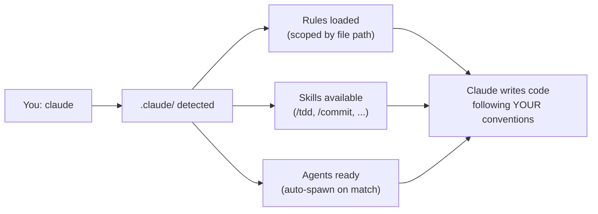

<div align="center">

# awesome-claude

**Not a list of links. A working `.claude/` directory you drop into any project.**

Battle-tested rules, skills, and agents that turn Claude Code into a senior engineer on your team.

[](LICENSE)
[](https://claude.ai/code)
[](#-quick-start)
[](#-rules)
[](#-skills)
[](#-agents)
[](CONTRIBUTING.md)

<br>

```
git clone git@github.com:Hedgehogues/awesome-claude.git .claude
```

Clone. Start Claude Code. Everything loads automatically.

</div>

---

## Why?

Out of the box, Claude Code is powerful but generic. It doesn't know your architecture, commit style, testing philosophy, or how your team works.

**You end up repeating the same instructions every session:**

> "Write tests first, then implementation"
> "Use DDD layers: domain -> application -> infrastructure -> presentation"
> "Stop and ask me if tests break -- don't try to fix them yourself"
> "Commit messages must have What/Why/Details sections"

**awesome-claude** solves this. Clone once -- Claude remembers forever.

---

## What's Inside

```
.claude/
├── rules/           60+ architecture & coding conventions
│   ├── arch/        DDD, database, 12-factor, code quality
│   │   ├── components/   aggregates, commands, events, queries
│   │   ├── db/           migrations, indexes, constraints, security
│   │   ├── environment/  12-factor app principles
│   │   └── functions/    refactoring techniques & anti-patterns
│   ├── break-stop.md     hard stop when tests break
│   ├── git.md            structured commit messages
│   ├── frontend-*.md     UI design, testing, components
│   └── ...
├── skills/          10 slash commands
│   ├── tdd/         test-driven development
│   ├── commit/      structured git commits
│   ├── triz/        TRIZ problem-solving (ARIZ-85V)
│   ├── tracing/     incident & bug tracing
│   ├── ui/          UI/UX engineering with TDD
│   ├── pipe/        skill pipeline orchestrator
│   └── ...
└── agents/          3 specialized sub-agents
    ├── planner.md
    ├── code-review-sentinel.md
    └── ui-ux-engineer.md
```

---

## How It Works



**Rules** use YAML frontmatter to scope when they activate. Claude only sees what's relevant -- not all 60+ rules at once:

```yaml
---
paths:
  - "src/domain/**"        # only loads when editing domain files
  - "src/application/**"
---
```

**Skills** are slash commands you invoke directly. Type `/tdd` and watch the full red-green-refactor cycle.

**Agents** are specialized sub-processes that Claude spawns automatically when the task matches their expertise.

---

## Quick Start

```bash
# 1. Clone into your project root
git clone git@github.com:Hedgehogues/awesome-claude.git .claude

# 2. Exclude from your project's git (it has its own repo)
echo ".claude/" >> .gitignore

# 3. Start Claude Code -- everything loads automatically
claude
```

**Updating:**

```bash
cd .claude && git pull
```

That's it. No config files. No setup scripts. No dependencies.

---

## Skills

Type a slash command in Claude Code to activate a skill. Each skill runs a full workflow -- not just a prompt, but a multi-step process with verification.

| Command | What It Does | Model |
|---------|-------------|-------|
| **`/tdd`** | Full TDD cycle: PlantUML diagrams, test plan, red tests, green implementation, refactor. Covers unit/state/security/integration/e2e. | Opus |
| **`/commit`** | Analyzes all changes, drafts structured commit (What/Why/Details), shows plan, waits for your approval. Never auto-pushes. | default |
| **`/triz`** | TRIZ problem-solving: ARIZ-85V algorithm -- contradiction analysis, IFR, 40 inventive principles, vepole analysis, structured resolution. | Opus |
| **`/tracing`** | Traces bugs across all layers (frontend -> API -> backend -> DB). Generates PlantUML sequence + C4 component diagrams showing the failure path. | Opus |
| **`/ui`** | Senior UI/UX engineer: TDD-first React components with accessibility, responsive design, visual cohesion. | Opus |
| **`/pipe`** | Meta-orchestrator: chains skills sequentially (`/pipe triz,tdd Fix the button`). Each phase runs in a dedicated Agent. | Opus |
| **`/test-all`** | Runs every test suite across all packages (unit, integration, e2e). Reports statistics with delta vs previous run. | Opus |
| **`/session-report`** | Generates product-focused summary of uncommitted changes, grouped by user-facing features. | default |
| **`/deploy`** | Docker rebuild + container restart + Alembic migrations. Adapt to your stack. | default |
| **`/describe`** | Quick project overview without running any commands. Pure text output. | default |

### How `/pipe` Works

Chain any skills into a sequential pipeline. Output of each phase feeds into the next:

```
/pipe triz,ui     "Sidebar is cramped on mobile"
       │    │
       │    └── Phase 2: UI engineer implements the TRIZ solution
       └─────── Phase 1: TRIZ analyzes the contradiction
```

```
/pipe tracing,tdd "Delete button doesn't work after deploy"
       │       │
       │       └── Phase 2: TDD writes tests + fix for the root cause
       └──────── Phase 1: Tracing finds where the request breaks
```

---

## Agents

Agents are specialized sub-processes that Claude Code spawns automatically when a task matches their expertise. You don't invoke them -- Claude does.

### Planner

**Activates on:** new features, complex tasks, multi-file changes

Analyzes requirements completeness (goal, acceptance criteria, edge cases, dependencies), maps affected files across DDD layers, assesses risks (architecture, DB, testing, performance, security), and produces a step-by-step implementation plan with verification steps and commit breakdown.

### Code Review Sentinel

**Activates on:** after writing or modifying code

Reviews against project rules with special focus on **test quality**. Flags trivial tests (mock assertions, vacuous truths, decorator testing), checks DDD layer violations, SOLID principles, security vulnerabilities. Renders verdict: APPROVE / REQUEST CHANGES / BLOCK.

### UI/UX Engineer

**Activates on:** frontend components, page redesigns, UX fixes

20+ years of design-to-code experience. Works test-first: writes Vitest + Testing Library tests before implementation. Builds modern 2020s interfaces with accessibility (ARIA, keyboard navigation), micro-interactions, responsive design, and CSS Modules. Enforces visual cohesion rule.

---

## Rules

Rules load automatically based on file path matching. When you edit `src/domain/user.py`, Claude sees DDD rules. When you edit `migrations/`, it sees database rules. No manual selection needed.

<details>
<summary><strong>Architecture -- DDD & Clean Architecture (11 rules)</strong></summary>

| Rule | What It Enforces |
|------|-----------------|
| `AGREGATES.md` | Aggregate design: identity, invariants, consistency boundary |
| `AGGREGATE_STRUCTURE.md` | Standard aggregate file layout |
| `COMMANDS.md` | Command pattern: validation, execution, idempotency |
| `EVENTS.md` | Domain events: naming, payload, ordering |
| `QURIES.md` | Query separation: read models, projections |
| `DOMAIN.md` | Pure domain layer: no infrastructure imports |
| `ONE_AGGREGATE_ONE_REPO.md` | Repository-per-aggregate rule |
| `SHARED_KERNEL.md` | Shared kernel boundaries and contracts |
| `SERVICES.md` | Application service orchestration rules |
| `VIEWS.md` | Presentation layer contracts |
| `STATE_OWNERSHIP.md` | Backend is the single source of truth for all mutable state |

</details>

<details>
<summary><strong>Database Design (12 rules)</strong></summary>

| Rule | What It Enforces |
|------|-----------------|
| `MIGRATIONS.md` | Safe migrations: reversible, no data loss |
| `INDEXES.md` | Index strategy: when to add, naming, composite |
| `CONSTRAINTS.md` | DB-level constraints: NOT NULL, CHECK, UNIQUE, FK |
| `NORMAL_FORMS.md` | Normalization rules and when to denormalize |
| `TRANSACTIONS.md` | Transaction boundaries and isolation levels |
| `VERSIONING.md` | Schema versioning strategy |
| `READ_MODEL.md` | Read-optimized projections |
| `WRITE_MODEL.md` | Write model design |
| `PERFORMANCE.md` | Query optimization, N+1 prevention |
| `RETENTION.md` | Data retention and cleanup policies |
| `SECURITY.md` | Least privilege, parameterized queries |
| `SEEDS_FIXTURES.md` | Test data management |

</details>

<details>
<summary><strong>12-Factor App (12 rules)</strong></summary>

| Rule | What It Enforces |
|------|-----------------|
| `CODEBASE.md` | One codebase, many deploys |
| `DEPENDENCIES.md` | Explicit dependency declaration |
| `CONFIG.md` | Config in environment variables |
| `BACKING_SERVICES.md` | Treat backing services as attached resources |
| `BUILD_RELEASE_RUN.md` | Strict separation of build and run stages |
| `PROCESS.md` | Stateless processes |
| `PORT_BINDING.md` | Export services via port binding |
| `CONCURRENCY.md` | Scale out via the process model |
| `DISPOSABILITY.md` | Fast startup, graceful shutdown |
| `DEV_PROD_PARITY.md` | Keep dev, staging, and prod similar |
| `ADMIN_PROCESSES.md` | Run admin tasks as one-off processes |
| `MAKEFILE.md` | Makefile as the universal entry point |

</details>

<details>
<summary><strong>Code Quality & Refactoring (11 rules)</strong></summary>

| Rule | What It Enforces |
|------|-----------------|
| `CHANGE_BREAKERS.md` | Patterns that make code hard to change |
| `INFLATORS.md` | Code bloat detection and prevention |
| `TRASHERS.md` | Dead code, unused imports, stale comments |
| `DEPS.md` | Dependency management and coupling |
| `OOP_DESIGN.md` | SOLID principles, composition over inheritance |
| `CONDITIONS.md` | Simplifying conditional logic |
| `DATA.md` | Data structure organization |
| `FUNCTIONS.md` | Function design: SRP, pure functions |
| `GENERALIZATIONS.md` | When and how to generalize |
| `METHODS.md` | Method extraction and composition |
| `SIMPLIFY.md` | Simplification techniques |

</details>

<details>
<summary><strong>Workflow & Conventions (12 rules)</strong></summary>

| Rule | What It Enforces |
|------|-----------------|
| `break-stop.md` | **Hard stop** when tests break -- ask before fixing |
| `git.md` | Commit messages with What / Why / Details sections |
| `meta-rules.md` | How to write and maintain rules themselves |
| `frontend-testing.md` | Vitest + Testing Library + Playwright patterns |
| `frontend-design.md` | Icons-first UI, accessibility, component patterns |
| `makefile.md` | Makefile hierarchy and delegation |
| `monorepo-structure.md` | Monorepo layout conventions |
| `ui-library.md` | 4-layer component architecture (tokens -> primitives -> shared -> domain) |
| `LLM_SECURITY.md` | Prompt injection prevention, output validation |
| `UNIT_TESTS.md` | Test contracts, not values; no shared mutable state |
| `LOGS.md` | Structured logging format and conventions |
| `MONITORING.md` | Metrics, alerts, and observability |
| `ARCH_TESTS.md` | Automated DDD contract validation (R1--R5) |
| `VISUAL_COHESION.md` | Domain-driven visual consistency across UI components |

</details>

---

## Customization

| What | Where | Tracked By |
|------|-------|-----------|
| Universal rules, skills, agents | `.claude/` | awesome-claude repo |
| Your project-specific instructions | `CLAUDE.md` in your project root | your project's repo |
| Project-specific skills (deploy, test-all) | edit in `.claude/skills/` after cloning | awesome-claude (local) |
| Personal preferences | `~/.claude/CLAUDE.md` | not tracked |

### Adding Your Own Rules

Create a markdown file in `.claude/rules/` with path scoping:

```markdown
<!-- .claude/rules/my-convention.md -->
---
paths:
  - "src/**/*.py"
---

# My Convention

All services must log entry and exit with structlog.
```

Claude will only see this rule when editing Python files under `src/`.

### Adapting Skills to Your Stack

Skills like `/deploy` and `/test-all` contain project-specific commands. After cloning, edit them to match your stack:

```bash
# Edit deploy skill for your infrastructure
vim .claude/skills/deploy/SKILL.md

# Edit test runner for your test setup
vim .claude/skills/test-all/SKILL.md
```

---

## Philosophy

This collection is opinionated. It encodes a specific engineering philosophy:

```
┌─────────────────────────────────────────────────────────┐
│                                                         │
│   Tests are specifications                              │
│   ── no red test, no requirement                        │
│                                                         │
│   Backend owns all state                                │
│   ── frontend is a stateless projection                 │
│                                                         │
│   Stop on red                                           │
│   ── never silently fix broken tests, always ask        │
│                                                         │
│   DDD layers                                            │
│   ── domain → application → infrastructure → presentation│
│                                                         │
│   Commits tell a story                                  │
│   ── What changed, Why, and Details                     │
│                                                         │
│   12-factor app                                         │
│   ── config in env, stateless processes, explicit deps  │
│                                                         │
│   Visual cohesion                                       │
│   ── same aggregate + same operation = one CSS pattern  │
│                                                         │
└─────────────────────────────────────────────────────────┘
```

If this matches how you work -- clone and go. If not -- fork and make it yours.

---

## FAQ

<details>
<summary><strong>Does this work with any project or only Python/React?</strong></summary>

The architecture rules (DDD, 12-factor, database, code quality) are **language-agnostic**. They apply to any backend with domain-driven design.

The frontend rules target React + TypeScript + Vite, but the principles (TDD, accessibility, visual cohesion) transfer to any UI framework.

Skills like `/deploy` and `/test-all` are project-specific by design -- edit them for your stack.

</details>

<details>
<summary><strong>Will all 60+ rules load at once and slow Claude down?</strong></summary>

No. Rules use YAML `paths:` frontmatter to scope activation. Claude only loads rules relevant to the files being edited. Editing `src/domain/` loads DDD rules. Editing `migrations/` loads database rules. No overlap.

</details>

<details>
<summary><strong>Can I use just the skills without the rules?</strong></summary>

Yes. Delete the `rules/` directory. Skills and agents work independently.

</details>

<details>
<summary><strong>How do I update?</strong></summary>

```bash
cd .claude && git pull
```

Since `.claude/` is its own git repo (excluded from your project via `.gitignore`), updating is just a pull.

</details>

<details>
<summary><strong>What if a rule conflicts with my project conventions?</strong></summary>

Three options:
1. **Override in `CLAUDE.md`** -- project-specific instructions in your root `CLAUDE.md` take precedence
2. **Edit the rule** -- modify it locally in `.claude/rules/`
3. **Delete the rule** -- remove files you don't need

</details>

<details>
<summary><strong>Do skills work with Claude Sonnet or only Opus?</strong></summary>

Most skills specify `model: opus` in their frontmatter for maximum quality on complex tasks (TDD, TRIZ, tracing). Simple skills (commit, describe, session-report) use whatever model you're running. You can change the `model:` field in any skill's YAML frontmatter.

</details>

---

## License

[MIT](LICENSE) -- use it, fork it, share it.
