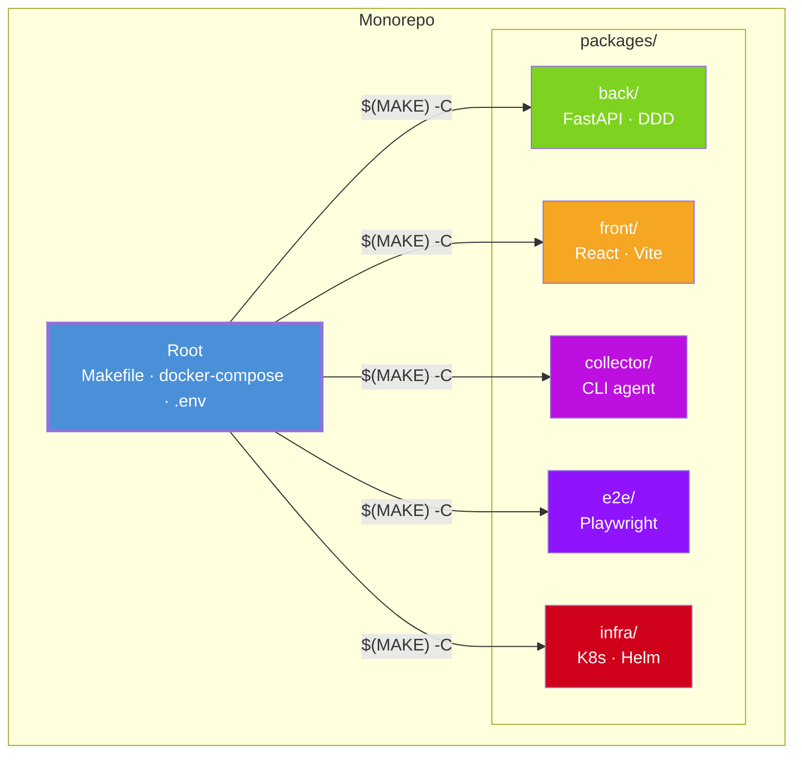
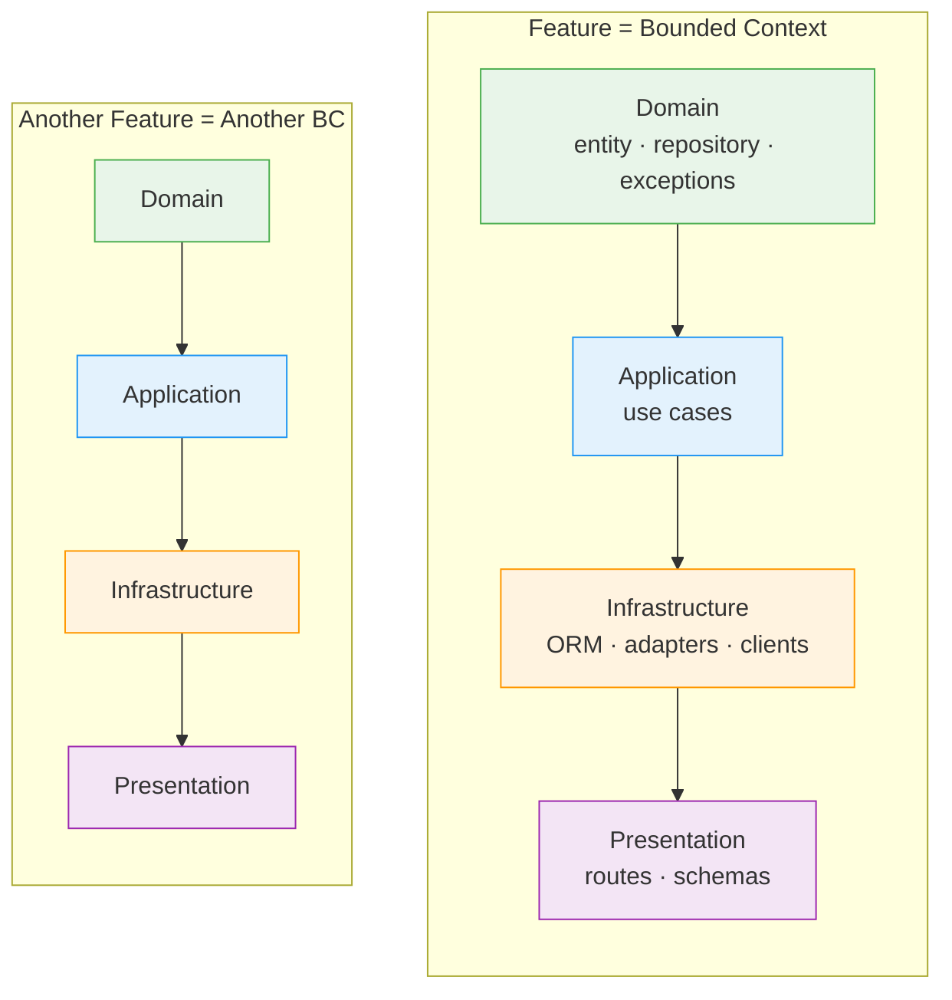
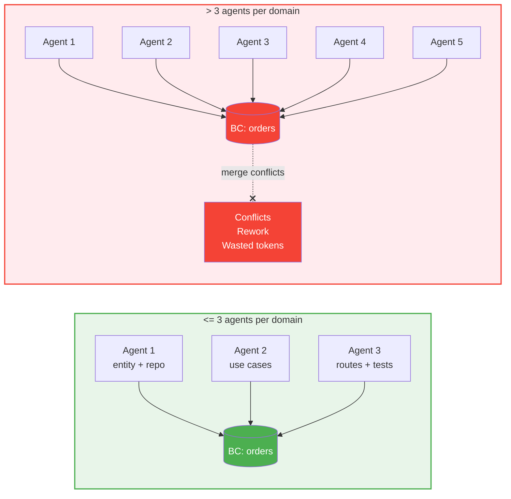
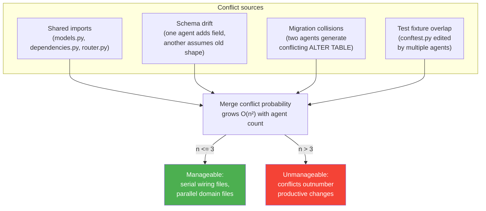
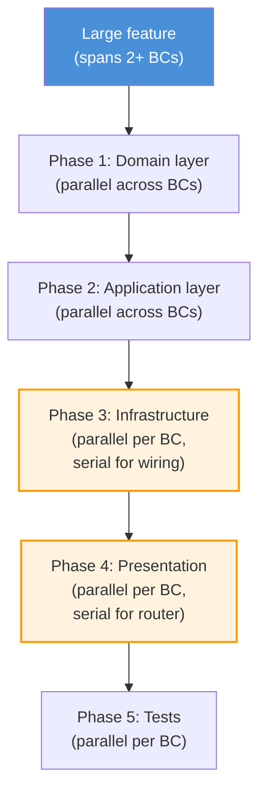
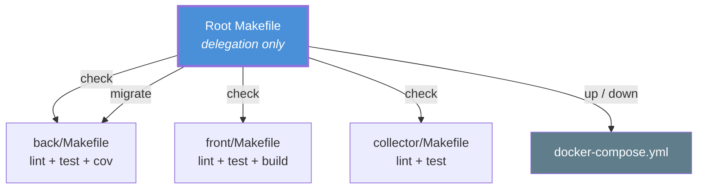
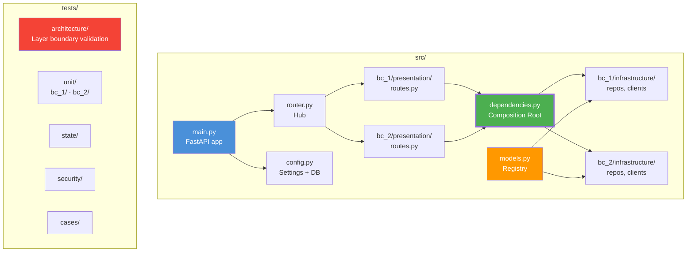
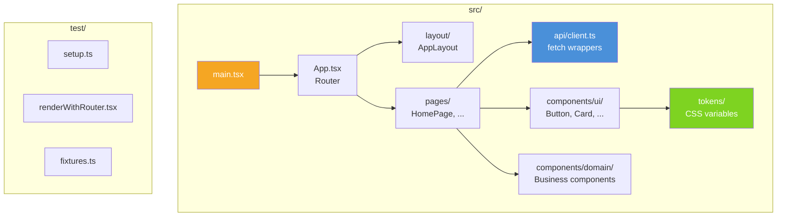
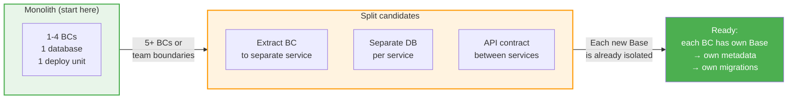
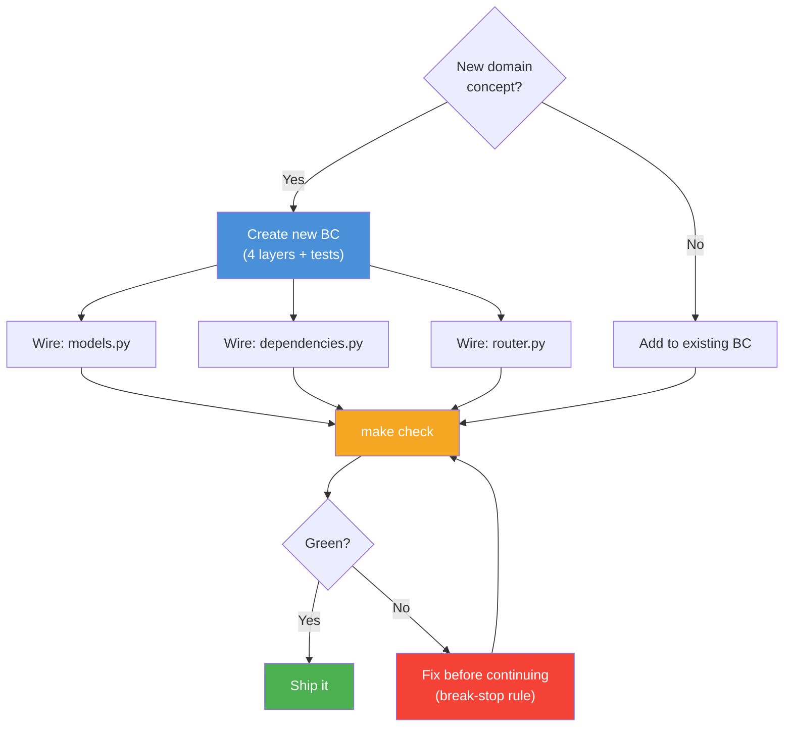

# Monorepo Organization Guide

How to structure a DDD monorepo for productive AI-assisted development.

---

## The Big Picture

**Root owns orchestration. Packages own logic.** The root Makefile never contains build/test/lint logic — only `$(MAKE) -C` delegation. Each package is self-contained: own Makefile, own config, own test suite.

---

## Features = Bounded Contexts

The number of features your product has is tightly coupled to the number of bounded contexts in the backend. Each BC is a vertical slice through all four DDD layers:

**One feature = one BC = one vertical slice.** Adding a feature means adding a new `src/<bc_name>/` directory with all four layers — not scattering files across existing directories.

---

## The 3-Agent Rule

> **Hard limit: no more than 3 concurrent AI agent groups per domain.**

This is an empirical finding, not a theoretical constraint. When more than 3 agent groups work on the same bounded context simultaneously, the result is:

### Why 3?

**The bottleneck is wiring files**, not domain logic. Each BC has independent domain/application/infrastructure code, but they all share:

| Wiring file | What it does | Why it conflicts |
|---|---|---|
| `models.py` | Imports all ORM models + merges metadata | Every new BC adds imports |
| `dependencies.py` | Composition root | Every new repo/client adds imports |
| `router.py` | Includes all sub-routers | Every new BC adds `include_router` |
| `conftest.py` | Shared test fixtures | Every new BC may add fixtures |
| `migrations/` | Alembic versions | Two concurrent `revision` = broken chain |

With 3 agents, you can serialize access to wiring files while parallelizing domain work. With 4+, the serial queue dominates and agents spend more time waiting or resolving conflicts than writing code.

### Practical patterns

| Pattern | When | How many agents |
|---|---|---|
| **Single BC, full stack** | New feature in one domain | 1 agent, sequential layers |
| **Multiple BCs, domain-first** | Cross-cutting feature | 2-3 agents parallel on domain, then serial wiring |
| **Scaffolding** | New project or new BC | 1 agent via `/init-repo` |

---

## Package Structure

### Two-Level Makefile

Every package MUST expose:

| Target | Contract |
|--------|----------|
| `check` | Single "is everything OK?" — what CI calls |
| `lint` | Static analysis: linter + formatter + types |
| `test` | All automated tests for the package |

### Backend Package Anatomy

### Frontend Package Anatomy

---

## Scaling: When to Split

The architecture prepares for this: each BC has its own `Base(DeclarativeBase)`, its own ORM models, and `models.py` merges them via `combined_metadata`. Splitting a BC into a separate service means:

1. Move `src/<bc_name>/` to a new package
2. Give it its own `config.py` + `main.py`
3. Replace in-process calls with HTTP/gRPC
4. No domain code changes needed

---

## Checklist: Adding a New Feature

Architecture tests will **automatically discover** new BCs via `discover_aggregates()` and validate layer boundaries — no test code changes needed.
