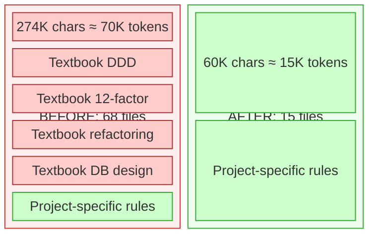
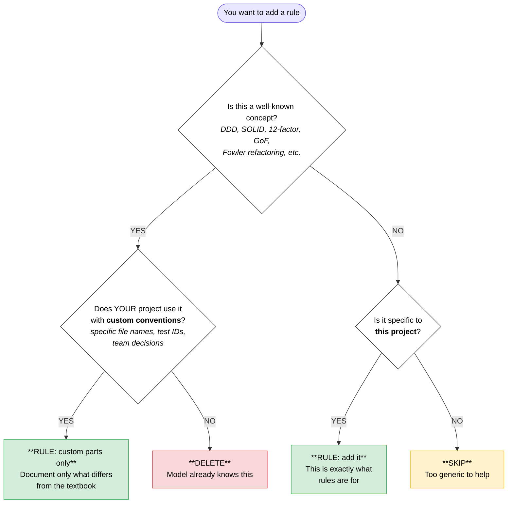
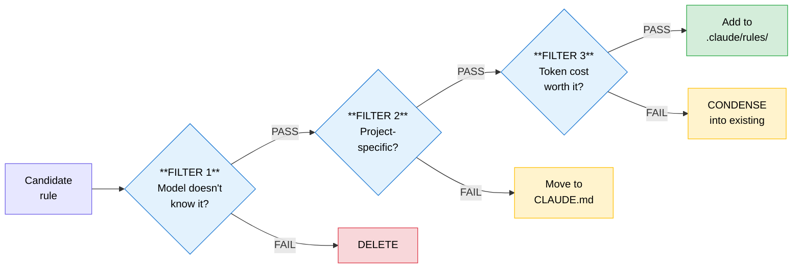
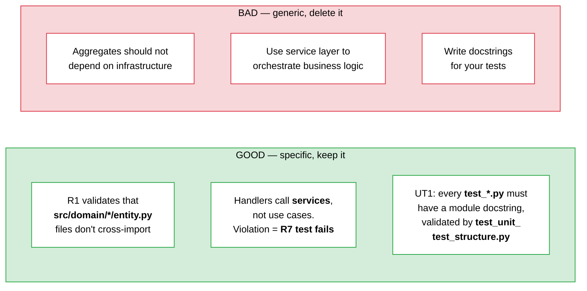
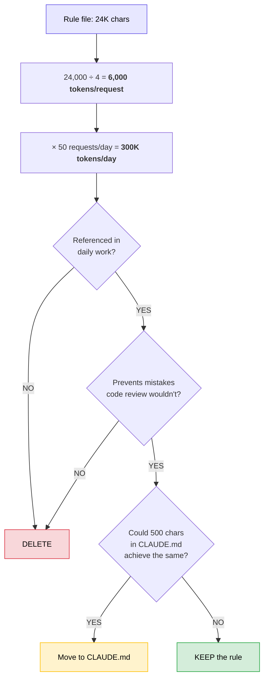
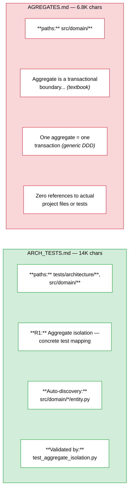
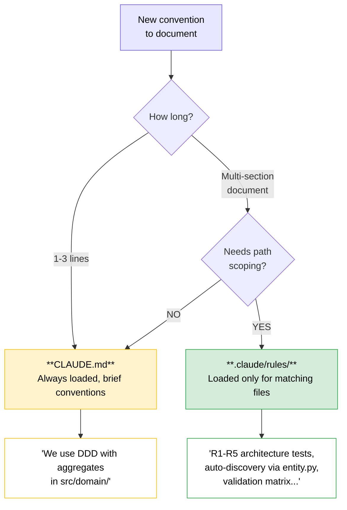
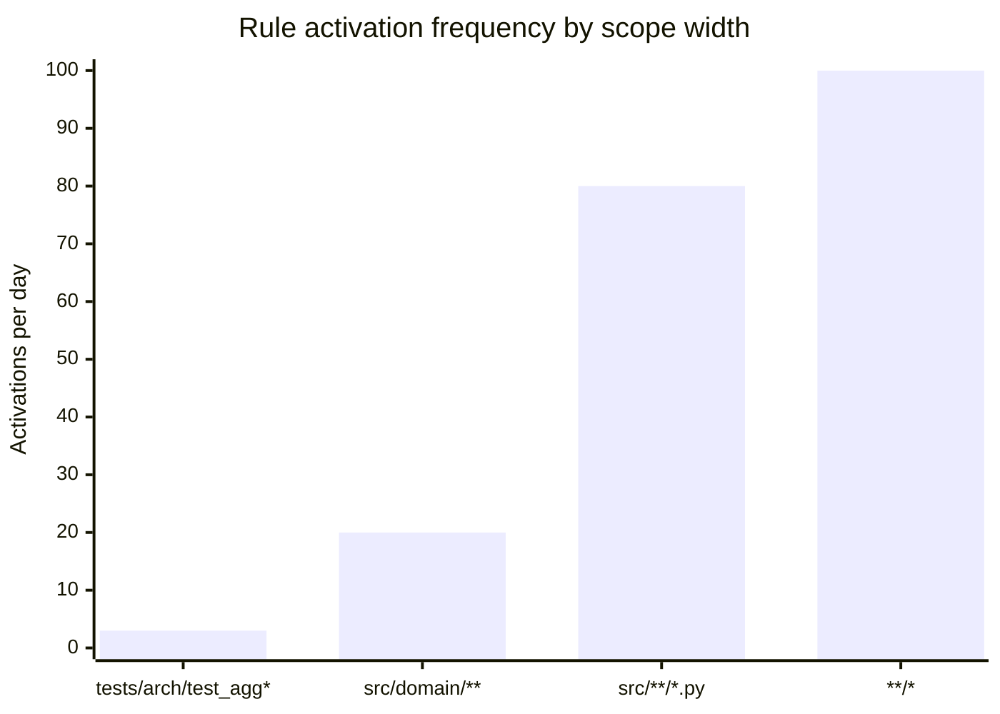
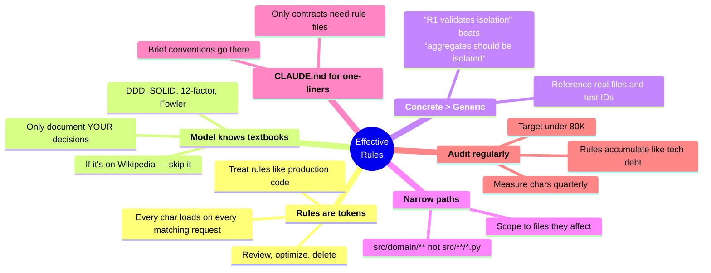

<div align="center">

# Writing Effective Rules for Claude Code

**A practical guide to `.claude/rules/` that improve quality without wasting tokens**

</div>

---

## The Core Problem

Every rule file in `.claude/rules/` is loaded into the context window on matching requests.
More rules = more tokens = more cost = slower responses.



> **Result: -78% tokens, -53 files, zero quality loss.**
> The red blocks were deleted — all textbook knowledge the model already has.

---

## Decision Tree: Should This Be a Rule?



---

## The Three Filters

Every candidate rule must pass **all three**. Failing any one = don't add it.



---

### Filter 1: Model Already Knows It

Claude's training data includes virtually every well-known engineering concept.
If your rule is a textbook summary — **delete it**.

| Category | Examples the model already knows |
|----------|------|
| **DDD** | Aggregates, entities, value objects, repositories, bounded contexts |
| **Principles** | SOLID, GRASP, DRY, KISS, YAGNI |
| **Infrastructure** | 12-factor app, port binding, stateless processes |
| **Refactoring** | Fowler catalog — extract method, replace conditional, simplify |
| **Database** | Normal forms, indexing, CONCURRENTLY, expand/contract migrations |
| **Transactions** | Isolation levels, optimistic locking, outbox pattern |
| **Observability** | Structured logging, Prometheus naming, RED/USE methods |
| **Design patterns** | GoF, repository, unit of work, specification |
| **Testing** | Testing pyramid, TDD, mocking strategies |
| **API design** | REST conventions, status codes, versioning |

> Putting these in rules = **paying tokens for a textbook the model already memorized.**

---

### Filter 2: Project-Specific

A good rule references **concrete artifacts** of your project.



---

### Filter 3: Token Cost

Every character in `rules/` is loaded on matching requests. Calculate the ROI:



---

## Anatomy of a Good Rule vs Bad Rule



| Trait | Good rule | Bad rule |
|-------|-----------|----------|
| **Scope** | Narrow `paths:` matching specific dirs | Broad `src/**/*.py` catch-all |
| **Content** | References real files, test IDs, conventions | Restates textbook definitions |
| **Testability** | Maps to executable tests (R1, UT1, etc.) | No way to verify compliance |
| **Uniqueness** | Information Claude can't derive from code | Knowledge already in model weights |

---

## Where to Put It



---

## Paths Scoping

`paths:` frontmatter controls when a rule activates. Narrow paths = rule loads less often = fewer wasted tokens.



| Scope | Loads for | When to use |
|-------|-----------|-------------|
| `tests/architecture/test_aggregate_*` | 3 files | Rule about one specific test |
| `src/domain/**` | ~20 files | DDD domain rules |
| `src/**/*.py` | ~80 files | Truly universal Python rules |
| `**/*` | Everything | Almost never appropriate |

> **Rule of thumb:** if your rule is about `src/domain/`, don't scope it to `src/**/*.py`.

---

## Audit Checklist

Run this quarterly on your `.claude/rules/` directory:

```bash
# Measure total token weight
find .claude/rules/ -name '*.md' -exec cat {} + | wc -c
```

| Check | If NO... |
|-------|----------|
| References specific files, tests, or conventions of THIS project? | Candidate for deletion |
| Would Claude produce wrong code without it? | Delete — it's confirmation bias |
| Is `paths:` scope as narrow as possible? | Tighten it |
| Could a one-liner in CLAUDE.md replace it? | Move and delete the file |
| Is the file > 5K chars? | Split or condense |
| Is the file unique (not duplicating another rule)? | Merge them |

> **Target: < 80K chars total.** Above 150K you're almost certainly paying for textbook knowledge.

---

## Summary


