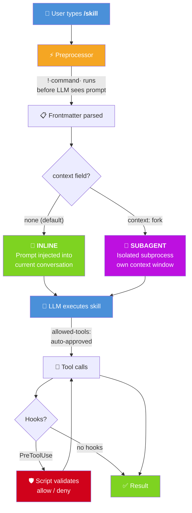
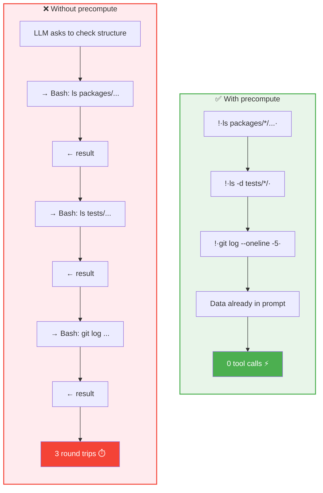
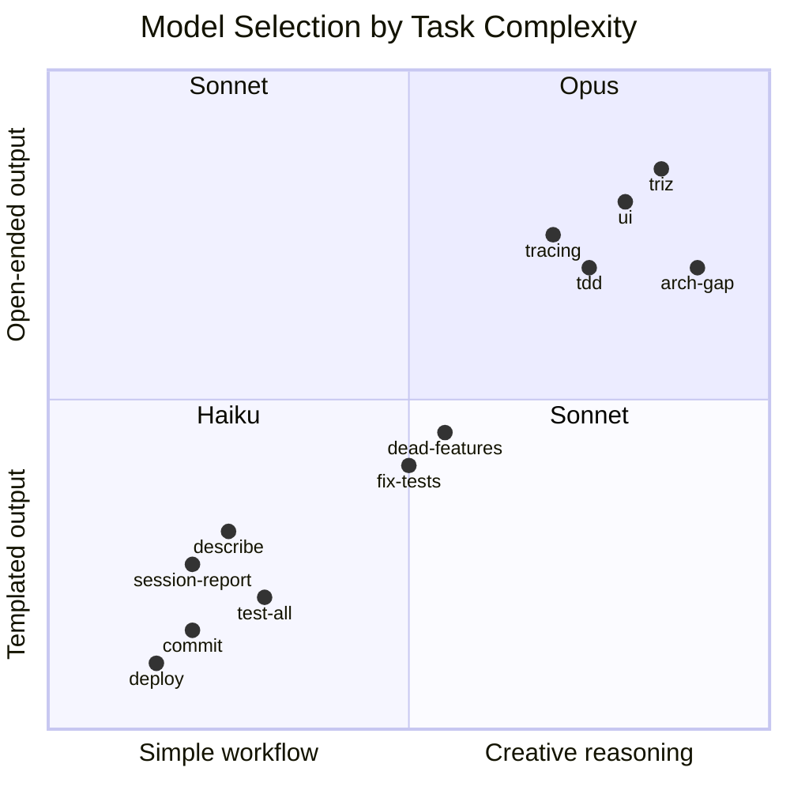
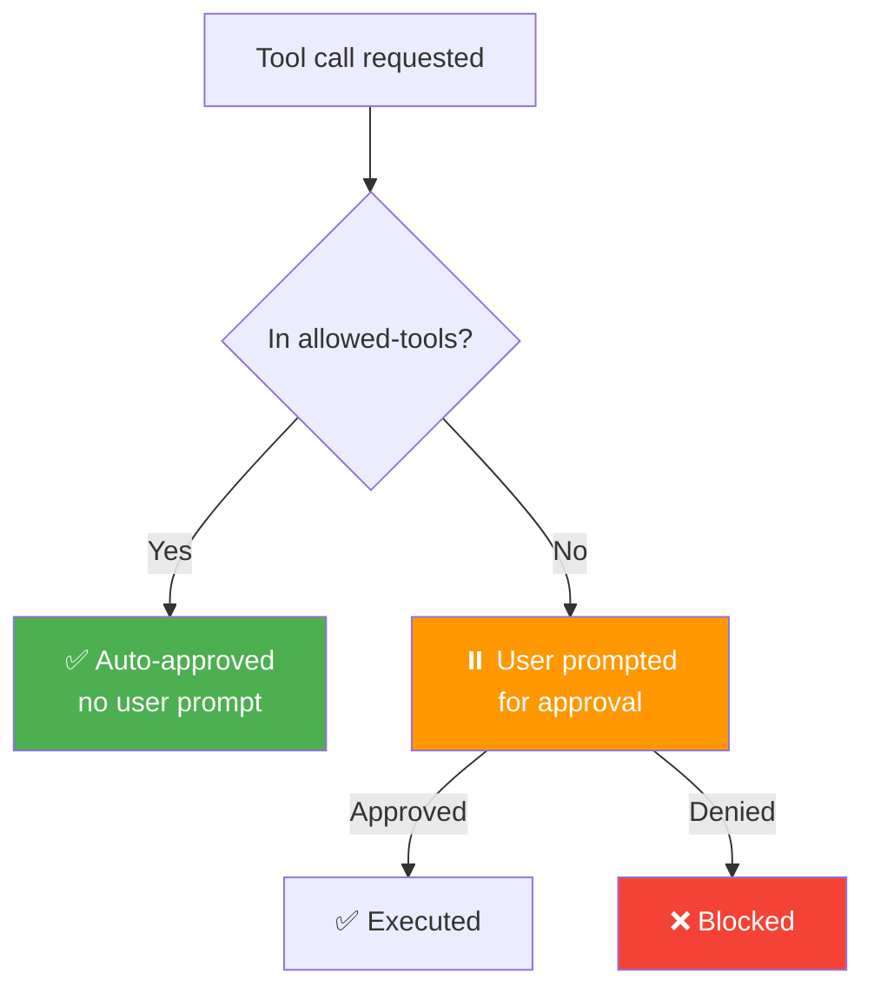
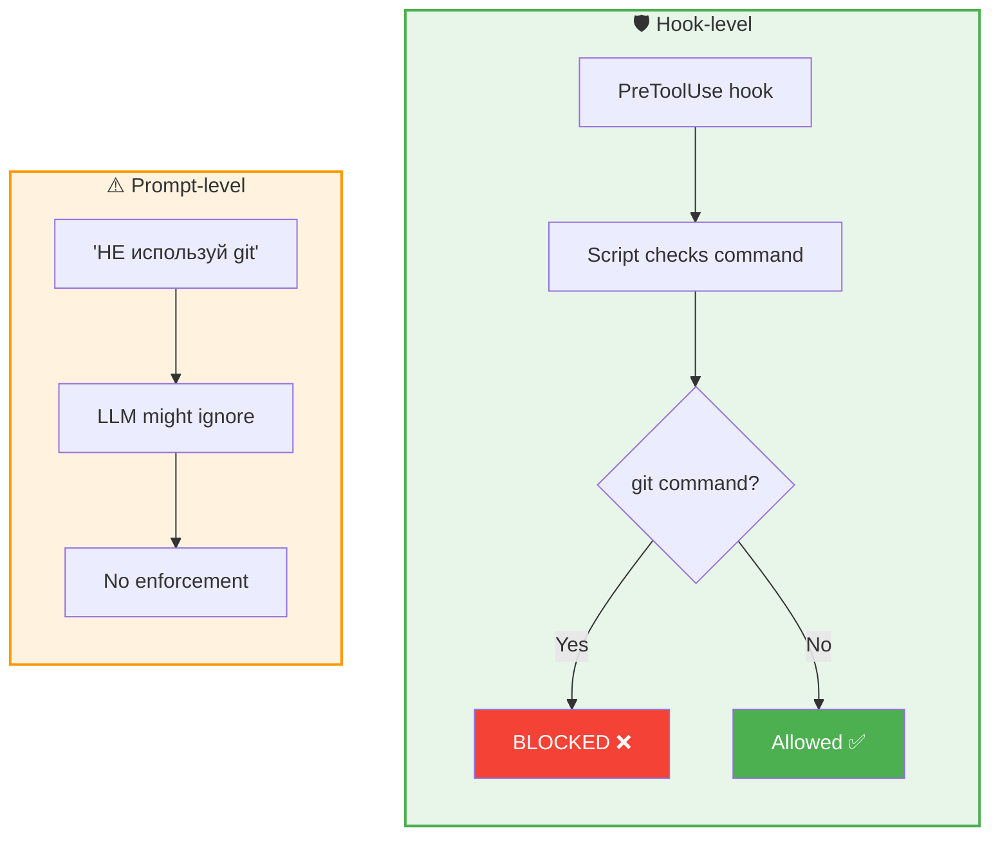
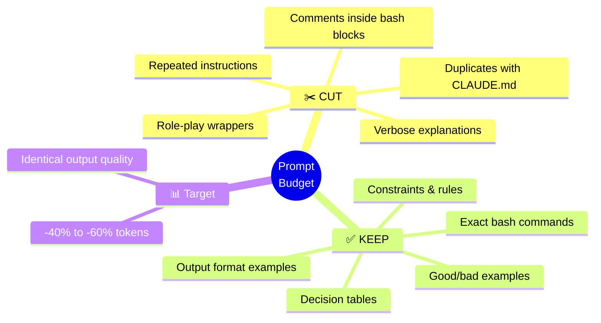
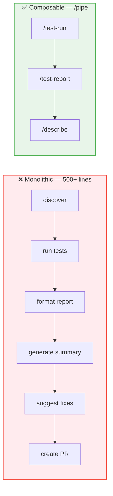
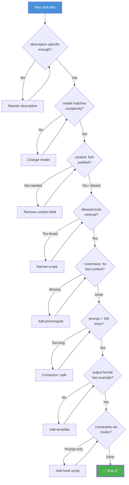

# Skill Design Principles

How to write efficient, high-quality Claude Code skills.

---

## Architecture



---

## Frontmatter Reference

```yaml
---
name: skill-name                    # slash command name
description: >                      # shown in /skills menu + used for auto-matching
  One paragraph explaining what     # be specific — Claude uses this to decide
  the skill does.                   # whether to auto-invoke

# --- Execution ---
model: haiku | opus | sonnet        # LLM to use (default: session model)
context: fork                       # omit for inline (default), fork for subagent
allowed-tools: Bash(git *), Read    # tools that skip user approval (not a restriction)

# --- Invocation ---
argument-hint: "[what args look like]"   # shown in /skills menu
disable-model-invocation: true           # Claude won't auto-invoke (only user /name)
user-invocable: false                    # hidden from / menu (only Claude can trigger)

# --- Scoping ---
paths:                              # only activate when editing matching files
  - "src/domain/**"

# --- Hooks ---
hooks:
  PreToolUse:
    - matcher: "Bash"               # tool name to intercept
      hooks:
        - type: command
          command: "${CLAUDE_SKILL_DIR}/scripts/check.sh"

# --- Other ---
shell: bash                         # bash (default) or powershell
---
```

### Variable Substitutions

| Variable | Resolves To |
|---|---|
| `$ARGUMENTS` | Everything after `/skill-name ` |
| `$0`, `$1`, ... | Positional arguments |
| `${CLAUDE_SESSION_ID}` | Current session ID |
| `${CLAUDE_SKILL_DIR}` | Absolute path to this skill's directory |
| `` !`command` `` | Shell output (runs before LLM sees the prompt) |

---

## Principles

### 1. Inline by Default

```mermaid
flowchart LR
    subgraph default ["✅ Default — no context field"]
        direction TB
        A1["Prompt injected into<br/>current conversation"] --> A2["Sees full history"]
        A2 --> A3["Zero overhead"]
        A3 --> A4["Shares tools & state"]
    end

    subgraph fork ["context: fork"]
        direction TB
        B1["Isolated subprocess"] --> B2["Own context window"]
        B2 --> B3["Cannot see history"]
        B3 --> B4["Returns single message"]
    end

    default ~~~ fork

    style default fill:#E8F5E9,stroke:#4CAF50,stroke-width:2px
    style fork fill:#FFF3E0,stroke:#FF9800,stroke-width:2px
```

Use `context: fork` **only** when:
- The skill produces massive output that would pollute the conversation
- The skill must run in parallel with other work
- The skill needs isolation from prior context

### 2. Precompute with `!`command``



**Rules:**
- Only fast commands: `ls`, `git log`, `git status`, `git diff --stat`, `cat`
- Never slow commands: `docker compose`, `npm`, `uv run`, `curl`
- Always add `2>/dev/null` — errors produce confusing prompt text
- Label the section `(предвычислено)` and tell LLM "already above — don't call again"

### 3. Right-Size the Model



| Model | When to Use | Effort Levels |
|---|---|---|
| **Haiku** | Explicit steps, templated output, no creative reasoning | Not supported |
| **Sonnet** | Code analysis, classification, moderate reasoning | low / medium / high |
| **Opus** | Multi-step reasoning, architecture, creative problem-solving | low / medium / high / max |
| **(none)** | Inherit session model — let the user decide | — |

### 4. Whitelist Tools with `allowed-tools`



> **`allowed-tools` is a whitelist, not a restriction.** Unlisted tools are still available — they just require user approval.

| Skill | allowed-tools | Principle |
|---|---|---|
| `/commit` | `Bash(git *), Read, Grep` | Git operations only |
| `/deploy` | `Bash(docker *), Bash(curl *), Read, Glob` | Docker + health checks |
| `/describe` | `Bash(git diff *), Bash(git log *), Read` | Read-only git |
| `/test-all` | `Bash(uv *), Bash(npx *), Bash(npm *), Bash(docker *), Bash(ls *), Glob, Read` | Test runners + discovery |
| `/session-report` | *(none)* | Works from conversation context |

**Principle of least privilege:** `Bash(git diff *)` not `Bash(git *)` if the skill only reads.

### 5. Enforce Constraints with Hooks



Hook scripts live in `${CLAUDE_SKILL_DIR}/scripts/` and receive JSON on stdin:

```json
{
  "eventType": "PreToolUse",
  "tool": "Bash",
  "tool_input": { "command": "git status" }
}
```

To deny, output:

```json
{
  "hookSpecificOutput": {
    "hookEventName": "PreToolUse",
    "permissionDecision": "deny",
    "permissionDecisionReason": "Reason shown to Claude"
  }
}
```

### 6. Compress Prompts



| What | Action | Why |
|---|---|---|
| "Ты — CI-оператор" | **Cut** | Role-play doesn't affect Haiku output |
| Monorepo structure description | **Cut** | Already in CLAUDE.md |
| `# comment` in bash blocks | **Cut** | LLM understands the command |
| Same rule in "Steps" and "Important" | **Cut** | Redundant — keep in one place |
| ASCII table example | **Keep** | Anchors exact output format |
| Good/bad output examples | **Keep** | Quality calibration |
| `uv run pytest --collect-only -q` | **Keep** | Exact syntax matters |

### 7. One Skill, One Job



If a skill exceeds **~200 lines**, consider splitting it into composable parts chainable via `/pipe`.

```
/pipe test-run,test-report,describe "Check everything"
```

Each skill: <150 lines, one clear responsibility.

---

## Checklist

Before shipping a new skill:



---

## Example: Minimal Skill

```yaml
---
name: changelog
description: >
  Generate changelog entry from recent commits.
  Groups by type (feat/fix/refactor), writes in past tense.
argument-hint: "[optional: version tag, e.g. 'v1.2.0']"
model: haiku
allowed-tools: Bash(git log *), Read
---
```

```markdown
# Задача

Сгенерируй changelog. $ARGUMENTS

## Контекст (предвычислено)

### Коммиты с последнего тега
!`git log $(git describe --tags --abbrev=0 2>/dev/null || echo HEAD~20)..HEAD --oneline 2>/dev/null`

## Формат

### [version] — YYYY-MM-DD

**Added**
- feat: description

**Fixed**
- fix: description

**Changed**
- refactor: description

## Правила

- Группируй по типу из commit message prefix
- Пиши в прошедшем времени
- Один bullet = один коммит
- Пропускай merge-коммиты и CI-фиксы
```

~30 lines. Precomputed context. Clear output template. Haiku handles this perfectly.
