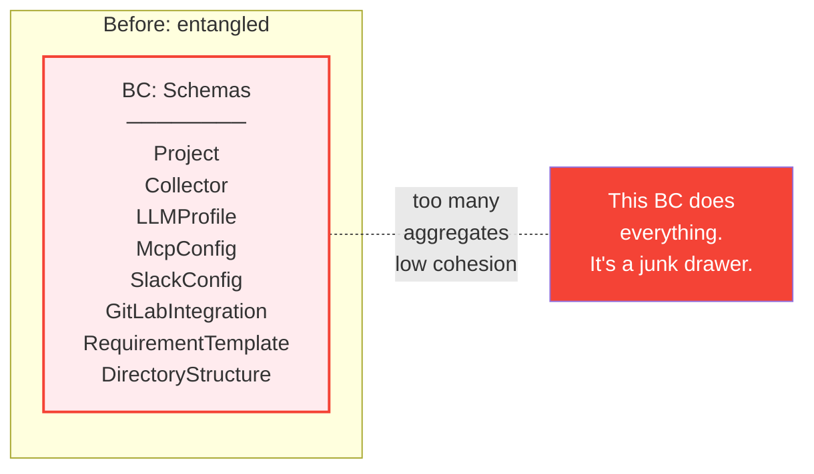
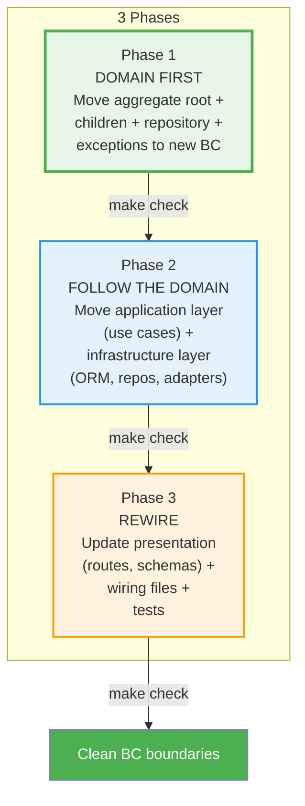
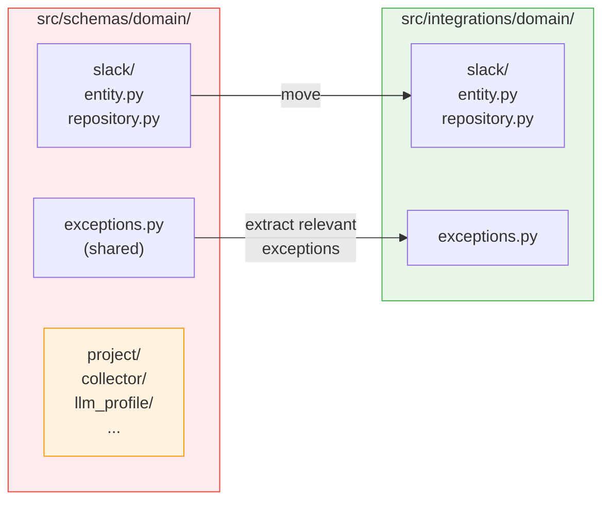
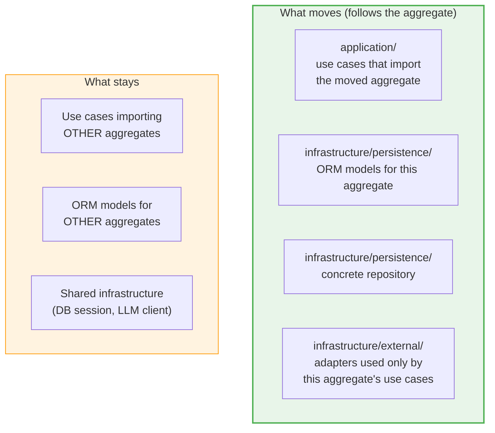
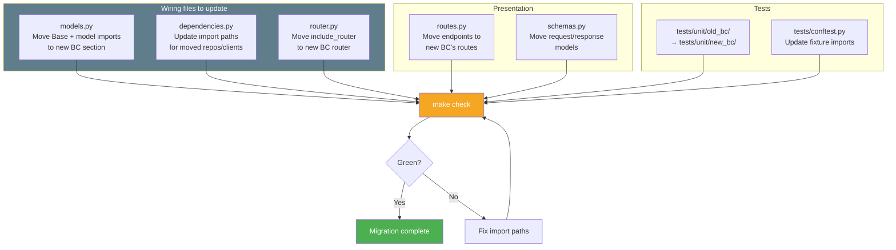
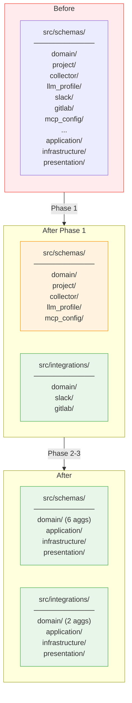
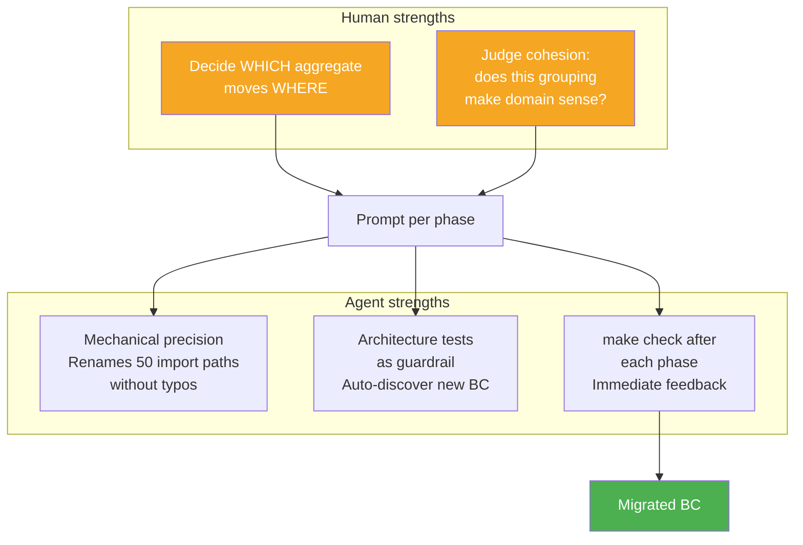
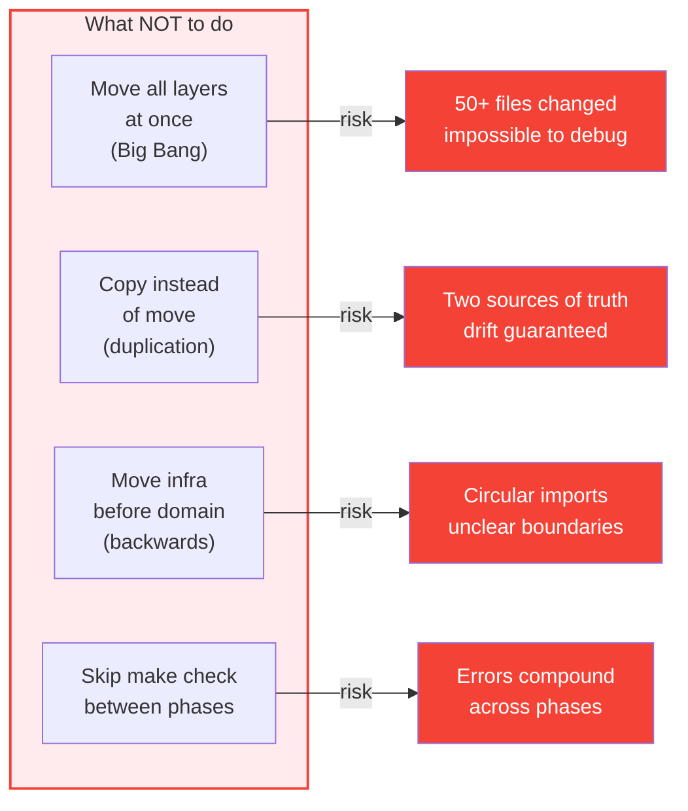

# Strangler Pattern for Bounded Context Reorganization

How to move aggregates between bounded contexts using AI agents without breaking the system.

---

## The Problem

As a product evolves, bounded context boundaries shift. What started as one domain splits into two, or aggregates end up in the wrong BC. Direct restructuring is risky — moving files breaks imports, wiring, tests, and migrations in unpredictable ways.



**Symptoms of a misplaced aggregate:**
- BC has 8+ aggregates with weak relationships
- Use cases import from multiple unrelated aggregates
- New features require touching 3+ BCs for one user story
- Team discussions start with "where does this belong?"

---

## The Strangler Approach

Instead of a Big Bang refactoring, use the **Strangler Fig** pattern: grow the new structure around the old one, move pieces incrementally, and remove the old shell when it's empty.



**The key insight: domain first, everything else follows.** Moving the aggregate root to a new BC is the atomic operation — it defines the new boundary. All other layers (application, infrastructure, presentation) are mechanically derived from where the domain lives.

---

## Phase 1: Move the Domain

This is the only phase that requires architectural judgment. Everything after is mechanical.



### What moves:
- `entity.py` — aggregate root + all child entities + enums
- `repository.py` — abstract repository interface
- Relevant exceptions from `exceptions.py` (extract, don't copy the whole file)
- `__init__.py` with re-exports

### What stays:
- Other aggregates in the old BC
- Shared value objects (move only if used exclusively by the migrating aggregate)

### After Phase 1:

```bash
make check   # Architecture tests auto-discover new location
             # Import errors show exactly what else needs to move
```

Architecture tests (`test_layer_boundaries.py`) will immediately detect the new BC via `discover_aggregates()`. Any remaining cross-BC imports become visible as test failures — they are your migration checklist.

---

## Phase 2: Follow the Domain

Move the layers that directly depend on the domain. The rule is simple: **if it imports the aggregate, it moves with it.**



### Decision table

| File | Imports moved aggregate? | Used by other BCs? | Action |
|------|------------------------|--------------------|---------|
| `create_slack_config.py` | Yes | No | **Move** |
| `submit_snapshot.py` | No | Yes | **Stay** |
| `SlackConfigModel` | Yes (maps to entity) | No | **Move** |
| `SlackAdapter` | Used by moved use case | No | **Move** |
| `LLMClient` | Used by many BCs | Yes | **Stay** (shared infra) |

### After Phase 2:

```bash
make check   # Remaining failures = wiring + presentation
```

---

## Phase 3: Rewire

Update the mechanical connections. This is the safest phase — pure import path changes.



---

## Complete Example: Extracting `integrations` BC



---

## Using AI Agents for Migration

The Strangler pattern works exceptionally well with Claude Code because each phase is a clear, scoped instruction:

```
Phase 1: "Move src/schemas/domain/slack/ and src/schemas/domain/gitlab/
          to a new bounded context src/integrations/domain/.
          Extract relevant exceptions. Run make check."

Phase 2: "Move all use cases and infrastructure that import from
          src/integrations/domain/ out of src/schemas/ into
          src/integrations/. Run make check."

Phase 3: "Update models.py, dependencies.py, router.py, and move
          routes + schemas. Move tests. Run make check."
```

### Why it works with agents



**Human decides the boundary. Agent executes the move.** This division plays to each party's strength — humans understand domain semantics, agents handle mechanical precision across dozens of files.

---

## Anti-Patterns



| Anti-pattern | Why it fails | Correct approach |
|---|---|---|
| Big Bang | Too many changes, can't isolate failures | 3 phases with `make check` between each |
| Copy-paste | Two copies of the entity diverge immediately | Move (delete from old, create in new) |
| Infrastructure first | Repo without entity = broken imports | Domain first, infra follows |
| No verification | Errors from phase 1 cascade to phase 3 | `make check` is mandatory between phases |
| Moving shared infra | Breaks other BCs that depend on it | Only move what's exclusive to the aggregate |
