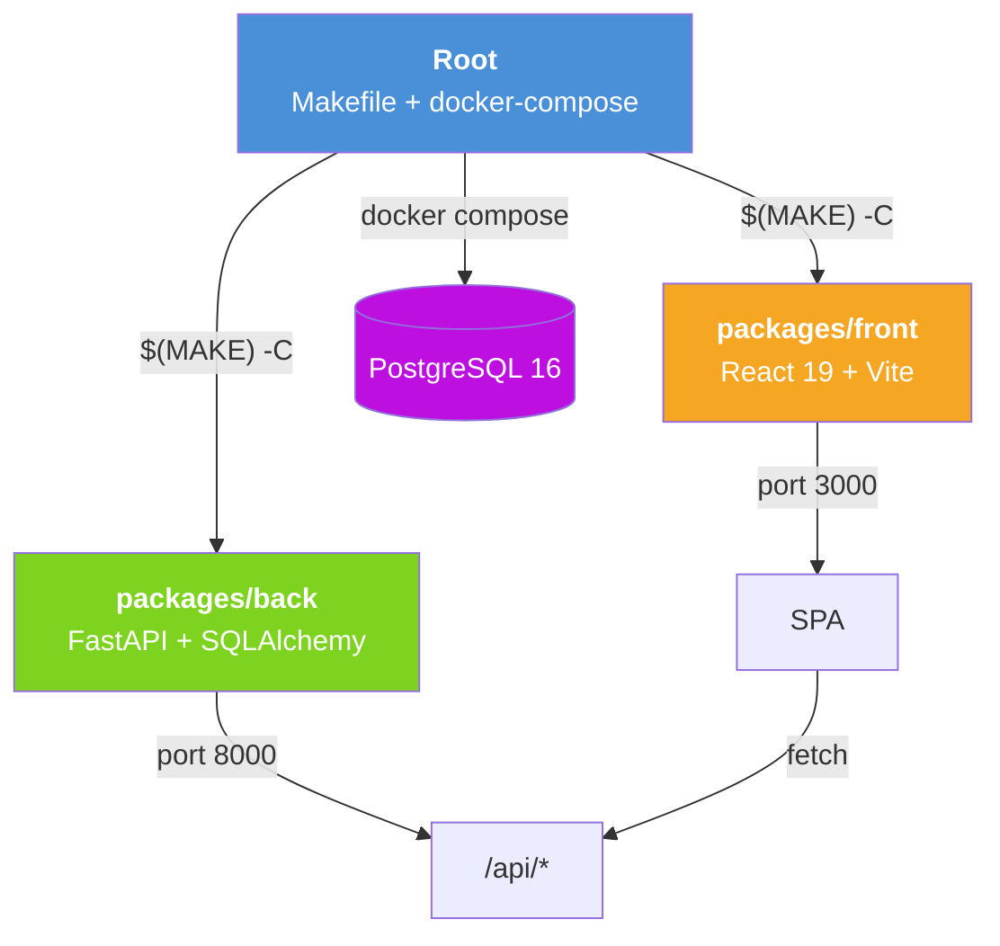
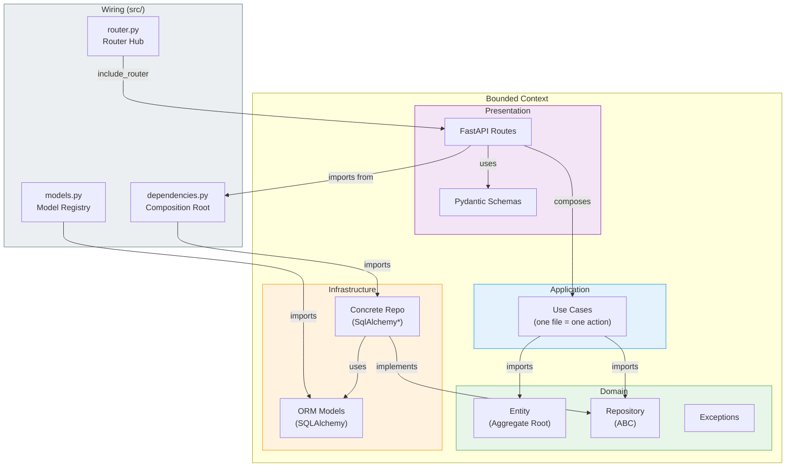
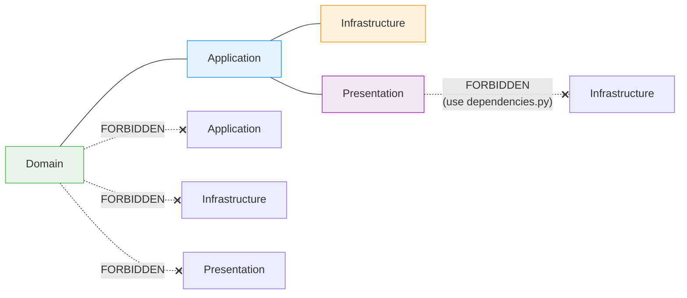
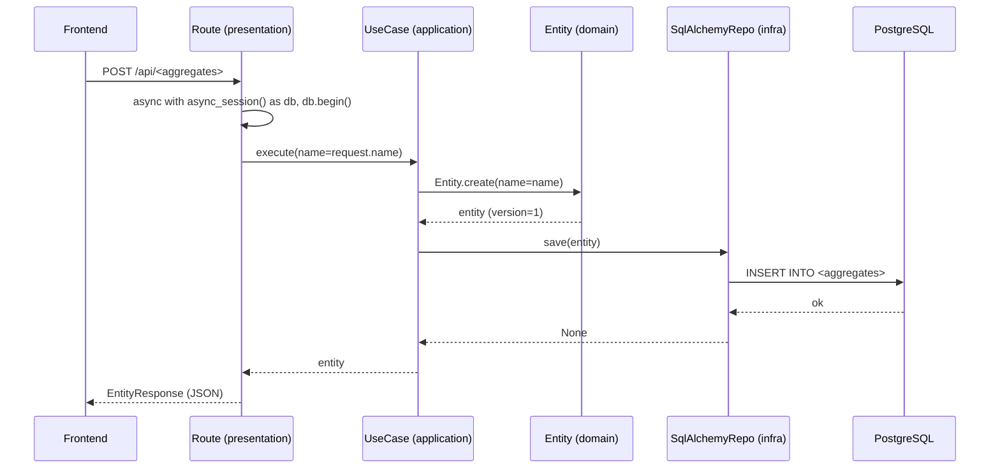
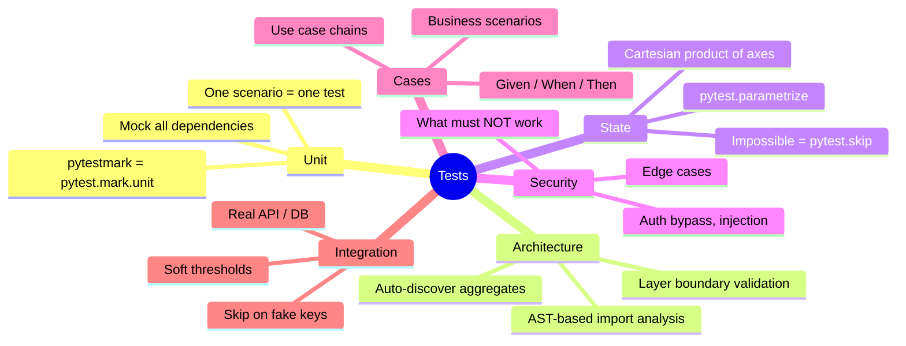
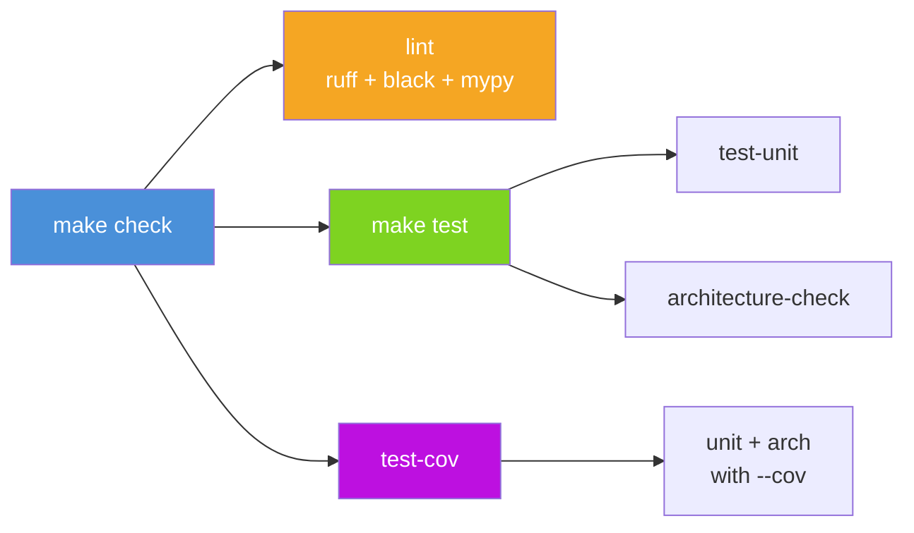
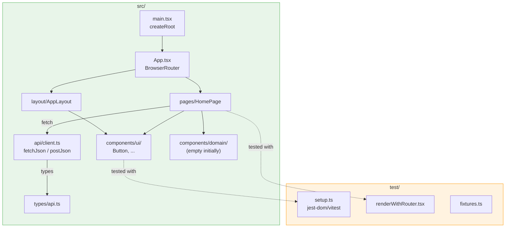
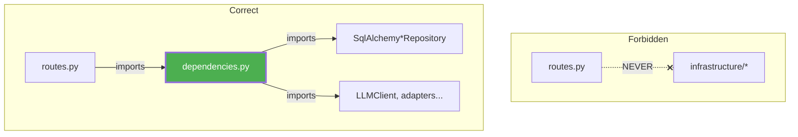
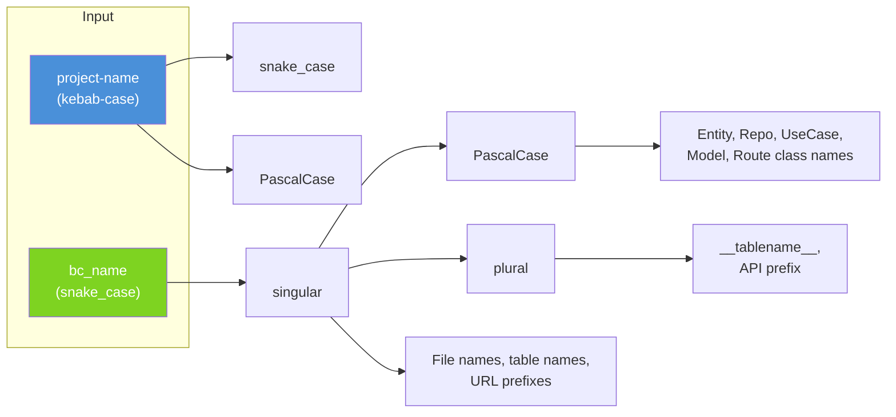
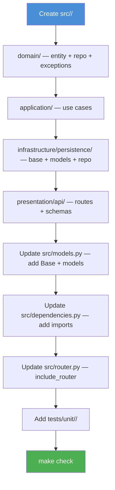

# init-repo: Architecture Principles

Design rationale and structural decisions behind the generated monorepo.

---

## Monorepo Topology



**Root owns orchestration, packages own logic.** Root Makefile never contains build/test/lint commands directly — only `$(MAKE) -C` delegation. Each package is self-contained: own Makefile, own config, own tests.

---

## DDD Layer Architecture (Backend)



---

## Layer Dependency Rules



| Layer | CAN import | CANNOT import | CANNOT use libs |
|-------|-----------|---------------|-----------------|
| **Domain** | stdlib only | application, infrastructure, presentation | sqlalchemy, fastapi, httpx, openai |
| **Application** | domain | presentation | sqlalchemy, fastapi, httpx, openai |
| **Infrastructure** | domain, external libs | presentation | — |
| **Presentation** | domain, `src.dependencies` | infrastructure directly | sqlalchemy |

These rules are **enforced by architecture tests** via AST analysis (`tests/architecture/test_layer_boundaries.py`).

---

## Request Flow



---

## Test Strategy



### Backend test targets



---

## Frontend Architecture



### Component pattern

```
ComponentName/
├── ComponentName.tsx          # React component
├── ComponentName.module.css   # CSS Module (scoped styles)
└── ComponentName.test.tsx     # Colocated test
```

---

## Composition Root Pattern



`dependencies.py` is the **single coupling point**. All concrete infrastructure implementations are imported here and re-exported. Presentation layer imports ONLY from this file — never from infrastructure directly.

---

## Naming Conventions



---

## Adding a New Bounded Context



Architecture tests (`test_layer_boundaries.py`) will **automatically discover** the new BC via `discover_aggregates()` — no test code changes needed.
